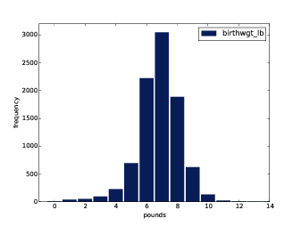

# Distributions {#distributions}


## Histograms


One of the best ways to describe a
variable is to report the values that appear in the dataset and how many
times each value appears. This description is called the **distribution** of the variable.

The most common representation of a
distribution is a **histogram**, which
is a graph that shows the **frequency** of each value. In this
context, “frequency” means the number of times the value appears.

In Python, an efficient way to compute
frequencies is with a dictionary. Given a sequence of values, `t`:

    hist = {}
    for x in t:
        hist[x] = hist.get(x, 0) + 1

The result is a dictionary that maps from
values to frequencies. Alternatively, you could use the `Counter` class defined in the `collections` module:

    from collections import Counter
    counter = Counter(t)

The result is a `Counter` object, which is a subclass
of dictionary.

Another option is to use the pandas
method `value_counts`, which we saw in the previous chapter. But for
this book I created a class, Hist, that represents histograms and
provides the methods that operate on them. 


## Representing Histograms


The `Hist` constructor can take a sequence,
dictionary, pandas `Series`, or another `Hist`. You can instantiate a `Hist`
object like this: 

    >>> import thinkstats2
    >>> hist = thinkstats2.Hist([1, 2, 2, 3, 5])
    >>> hist
    Hist({1: 1, 2: 2, 3: 1, 5: 1})

`Hist` objects provide `Freq`, which takes a value and
returns its frequency: 

    >>> hist.Freq(2)
    2

The bracket operator does the same thing:

    >>> hist[2]
    2

If you look up a value that has never
appeared, the frequency is 0.

    >>> hist.Freq(4)
    0

`Values` returns an unsorted list of
the values in the Hist:

    >>> hist.Values()
    [1, 5, 3, 2]

To loop through the values in order, you
can use the built-in function `sorted`:

    for val in sorted(hist.Values()):
        print(val, hist.Freq(val))

Or you can use `Items` to iterate through
value-frequency pairs: 

    for val, freq in hist.Items():
         print(val, freq)


## Plotting Histograms

```{r first-wgt-lb-hist, echo=F, out.width='90%', fig.align='center', fig.show='hold', fig.cap='Histogram of the pound part of birth weight.'}

```

For this book I wrote a module called
`thinkplot.py` that provides functions for plotting Hists and other objects defined in `thinkstats2.py`. 
It is based on `pyplot`, which is part of the `matplotlib` package. See
Section \@ref(using-the-code) for information about installing `matplotlib`. 

To plot `hist` with `thinkplot`, try this: 

    >>> import thinkplot
    >>> thinkplot.Hist(hist)
    >>> thinkplot.Show(xlabel='value', ylabel='frequency')

You can read the documentation for `thinkplot` at [http://greenteapress.com/thinkstats2/thinkplot.html](http://greenteapress.com/thinkstats2/thinkplot.html)

```{r first-wgt-oz-hist, echo=F, out.width='90%', fig.align='center', fig.show='hold', fig.cap='Histogram of the ounce part of birth weight.'}
knitr::include_graphics("images/02.png")
```
    
    
## NSFG Variables


Now let’s get back to the data from the
NSFG. The code in this chapter is in `first.py`. For information about
downloading and working with this code, see Section \@ref(using-the-code).

When you start working with a new
dataset, I suggest you explore the variables you are planning to use one
at a time, and a good way to start is by looking at histograms.

In Section [1.6][transformation] we transformed `agepreg` from centiyears to years,
and combined `birthwgt_lb` and `birthwgt_oz` into a single quantity,
`totalwgt_lb`. In this section I use these variables to demonstrate some
features of histograms.

```{r first-agepreg-hist, echo=F, out.width='90%', fig.align='center', fig.show='hold', fig.cap='Histogram of mother’s age at end of pregnancy.'}
knitr::include_graphics("images/03.png")
```

I’ll start by reading the data and selecting records for live births:

        preg = nsfg.ReadFemPreg()
        live = preg[preg.outcome == 1]

The expression in brackets is a boolean
Series that selects rows from the DataFrame and returns a new DataFrame.
Next I generate and plot the histogram of `birthwgt_lb` for live births.

        hist = thinkstats2.Hist(live.birthwgt_lb, label='birthwgt_lb')
        thinkplot.Hist(hist)
        thinkplot.Show(xlabel='pounds', ylabel='frequency')

When the argument passed to Hist is a pandas Series, any `nan` values
are dropped. `label` is a
string that appears in the legend when the Hist is plotted. 


```{r first-prglngth-hist, echo=F, out.width='90%', fig.align='center', fig.show='hold', fig.cap='Histogram of pregnancy length in weeks.'}

```


Figure [2.1](#first-wgt-lb-hist) shows the result. The most common value,
called the **mode**, is 7 pounds. The
distribution is approximately bell-shaped, which is the shape of the
**normal** distribution, also called a **Gaussian** distribution. But unlike
a true normal distribution, this distribution is asymmetric; it has a **tail** that extends farther to the
left than to the right.

Figure [2.2](#first-wgt-oz-hist) shows the histogram of `birthwgt_oz`, which is
the ounces part of birth weight. In theory we expect this distribution
to be **uniform**; that is, all values
should have the same frequency. In fact, 0 is more common than the other
values, and 1 and 15 are less common, probably because respondents round
off birth weights that are close to an integer value. 

Figure [2.3](#first-agepreg-hist) shows the histogram of `agepreg`, the mother’s
age at the end of pregnancy. The mode is 21 years. The distribution is
very roughly bell-shaped, but in this case the tail extends farther to
the right than left; most mothers are in their 20s, fewer in their
30s.

Figure [2.4](#first-prglngth-hist) shows the histogram of `prglngth`, the length
of the pregnancy in weeks. By far the most common value is 39 weeks. The
left tail is longer than the right; early babies are common, but
pregnancies seldom go past 43 weeks, and doctors often intervene if they
do. 


## Outliers


Looking at histograms, it is easy to
identify the most common values and the shape of the distribution, but
rare values are not always visible. 

Before going on, it is a good idea to
check for **outliers**, which are
extreme values that might be errors in measurement and recording, or
might be accurate reports of rare events. 

Hist provides methods `Largest` and `Smallest`, which take an integer
`n` and return the `n` largest or smallest values from
the histogram: 

        for weeks, freq in hist.Smallest(10):
            print(weeks, freq)

In the list of pregnancy lengths for live
births, the 10 lowest values are `[0, 4, 9, 13, 17, 18, 19, 20, 21,
22\]`. Values below 10 weeks are certainly errors; the most likely
explanation is that the outcome was not coded correctly. Values higher
than 30 weeks are probably legitimate. Between 10 and 30 weeks, it is
hard to be sure; some values are probably errors, but some represent
premature babies. 

On the other end of the range, the
highest values are: 

    weeks  count
    43     148
    44     46
    45     10
    46     1
    47     1
    48     7
    50     2

Most doctors recommend induced labor if a
pregnancy exceeds 42 weeks, so some of the longer values are surprising.
In particular, 50 weeks seems medically unlikely.

The best way to handle outliers depends
on “domain knowledge”; that is, information about where the data come
from and what they mean. And it depends on what analysis you are
planning to perform. 

In this example, the motivating question
is whether first babies tend to be early (or late). When people ask this
question, they are usually interested in full-term pregnancies, so for
this analysis I will focus on pregnancies longer than 27 weeks.


## First Babies


Now we can compare the distribution of
pregnancy lengths for first babies and others. I divided the DataFrame
of live births using `birthord`, and computed their
histograms: 

        firsts = live[live.birthord == 1]
        others = live[live.birthord != 1]

        first_hist = thinkstats2.Hist(firsts.prglngth)
        other_hist = thinkstats2.Hist(others.prglngth)

Then I plotted their histograms on the
same axis:

        width = 0.45
        thinkplot.PrePlot(2)
        thinkplot.Hist(first_hist, align='right', width=width)
        thinkplot.Hist(other_hist, align='left', width=width)
        thinkplot.Show(xlabel='weeks', ylabel='frequency',
                       xlim=[27, 46])

`thinkplot.PrePlot` takes the number
of histograms we are planning to plot; it uses this information to
choose an appropriate collection of colors. 

```{r first-nsfg-hist, echo=F, out.width='90%', fig.align='center', fig.show='hold', fig.cap='Histogram of pregnancy lengths.'}
knitr::include_graphics("images/05.png")
```

`thinkplot.Hist` normally uses `align=’center’` so that each bar is
centered over its value. For this figure, I use `align=’right’` and `align=’left’` to place corresponding
bars on either side of the value. 

With `width=0.45`, the total width of the
two bars is 0.9, leaving some space between each pair.

Finally, I adjust the axis to show only
data between 27 and 46 weeks. Figure [2.5](#first_nsfg_hist) shows the result. 

Histograms are useful because they make
the most frequent values immediately apparent. But they are not the best
choice for comparing two distributions. In this example, there are fewer
“first babies” than “others,” so some of the apparent differences in the
histograms are due to sample sizes. In the next chapter we address this
problem using probability mass functions.


## Summarizing Distributions


A histogram is a complete description of
the distribution of a sample; that is, given a histogram, we could
reconstruct the values in the sample (although not their order).

If the details of the distribution are
important, it might be necessary to present a histogram. But often we
want to summarize the distribution with a few descriptive
statistics.

Some of the characteristics we might want
to report are:

-   central tendency: Do the values tend
    to cluster around a particular point? 
-   modes: Is there more than one
    cluster? 
-   spread: How much variability is there
    in the values? 
-   tails: How quickly do the
    probabilities drop off as we move away from the modes? 
-   outliers: Are there extreme values
    far from the modes? 

Statistics designed to answer these
questions are called **summary statistics**. By far the most common summary statistic is the **mean**, 
which is meant to describe the central tendency of the distribution. 

If you have a sample of `n` values, $x_i$, the mean, <span
style="text-decoration:overline">x</span>, is the sum of the values
divided by the number of values; in other words

$$
\bar{x} = \frac 1n \sum_i x_i
$$


The words “mean” and “average” are
sometimes used interchangeably, but I make this distinction:</span>

-   The “mean” of a sample is the summary
    statistic computed with the previous formula.</span>
-   An “average” is one of several
    summary statistics you might choose to describe a central tendency.

Sometimes the mean is a good description
of a set of values. For example, apples are all pretty much the same
size (at least the ones sold in supermarkets). So if I buy 6 apples and
the total weight is 3 pounds, it would be a reasonable summary to say
they are about a half pound each. 

But pumpkins are more diverse. Suppose I
grow several varieties in my garden, and one day I harvest three
decorative pumpkins that are 1 pound each, two pie pumpkins that are 3
pounds each, and one Atlantic Giant® pumpkin that weighs 591 pounds. The
mean of this sample is 100 pounds, but if I told you “The average
pumpkin in my garden is 100 pounds,” that would be misleading. In this
example, there is no meaningful average because there is no typical
pumpkin. 


## Variance


If there is no single number that
summarizes pumpkin weights, we can do a little better with two numbers:
mean and **variance**.

Variance is a summary statistic intended
to describe the variability or spread of a distribution. The variance of
a set of values is


$$
S^2 = \frac 1n \sum_i (x_i - \bar x)^2
$$

The term $x_i$ − <span
style="text-decoration:overline">x</span> is called the “deviation from
the mean,” so variance is the mean squared deviation. The square root of
variance, $S$, is the **standard deviation**. 

If you have prior experience, you might
have seen a formula for variance with $n-1$ in the denominator, rather than
`n`. This statistic is used to
estimate the variance in a population using a sample. We will come back
to this in Chapter [8](thinkstats2009.html#estimation). 

Pandas data structures provides methods
to compute mean, variance and standard deviation: 

        mean = live.prglngth.mean()
        var = live.prglngth.var()
        std = live.prglngth.std()

For all live births, the mean pregnancy
length is 38.6 weeks, the standard deviation is 2.7 weeks, which means
we should expect deviations of 2-3 weeks to be common. 

Variance of pregnancy length is 7.3,
which is hard to interpret, especially since the units are
weeks<sup>2</sup>, or “square weeks.” Variance is useful in some
calculations, but it is not a good summary statistic.


## Effect Size


An **effect size** is a summary statistic intended to describe (wait for it)
the size of an effect. For example, to describe the difference between
two groups, one obvious choice is the difference in the means.

Mean pregnancy length for first babies is
38.601; for other babies it is 38.523. The difference is 0.078 weeks,
which works out to 13 hours. As a fraction of the typical pregnancy
length, this difference is about 0.2%. 

If we assume this estimate is accurate,
such a difference would have no practical consequences. In fact, without
observing a large number of pregnancies, it is unlikely that anyone
would notice this difference at all. 

Another way to convey the size of the
effect is to compare the difference between groups to the variability
within groups. Cohen’s $d$ is a
statistic intended to do that; it is defined

$$
d = \frac{\bar x_1 - \bar x_2}{s}
$$

where $\bar x_1$ and $\bar x_2$ are the means of the groups
and $s$ is the “pooled standard
deviation”. Here’s the Python code that computes Cohen’s $d$: 

    def CohenEffectSize(group1, group2):
        diff = group1.mean() - group2.mean()

        var1 = group1.var()
        var2 = group2.var()
        n1, n2 = len(group1), len(group2)

        pooled_var = (n1 * var1 + n2 * var2) / (n1 + n2)
        d = diff / math.sqrt(pooled_var)
        return d

In this example, the difference in means
is 0.029 standard deviations, which is small. To put that in
perspective, the difference in height between men and women is about 1.7
standard deviations (see [https://en.wikipedia.org/wiki/Effect\_size](https://en.wikipedia.org/wiki/Effect_size)).


## Reporting Results


We have seen several ways to describe the
difference in pregnancy length (if there is one) between first babies
and others. How should we report these results? 

The answer depends on who is asking the
question. A scientist might be interested in any (real) effect, no
matter how small. A doctor might only care about effects that are **clinically significant**; that is,
differences that affect treatment decisions. A pregnant woman might be
interested in results that are relevant to her, like the probability of
delivering early or late. 

How you report results also depends on
your goals. If you are trying to demonstrate the importance of an
effect, you might choose summary statistics that emphasize differences.
If you are trying to reassure a patient, you might choose statistics
that put the differences in context.

Of course your decisions should also be
guided by professional ethics. It’s ok to be persuasive; you *should*
design statistical reports and visualizations that tell a story clearly.
But you should also do your best to make your reports honest, and to
acknowledge uncertainty and limitations. 


## Exercises


**Exercise 1**   
Based on the results in this chapter, suppose you were asked to summarize what you learned about
whether first babies arrive late.

Which summary statistics would you use
if you wanted to get a story on the evening news? Which ones would you
use if you wanted to reassure an anxious patient?

Finally, imagine that you are Cecil Adams, author of *The Straight
Dope* ([http://straightdope.com](http://straightdope.com)), and your job is to answer the question, “Do
first babies arrive late?” Write a paragraph that uses the results in
this chapter to answer the question clearly, precisely, and honestly.

**Exercise 2**   
In the repository you downloaded, you should find a file named `chap02ex.ipynb`; open it. Some
cells are already filled in, and you should execute them. Other cells
give you instructions for exercises. Follow the instructions and fill in
the answers.

*A solution to this exercise is in `chap02soln.ipynb`*

In the repository you downloaded, you
should find a file named `chap02ex.py`; you can use this file as a
starting place for the following exercises. My solution is in
`chap02soln.py`.</span>

**Exercise 3**   
The mode of a distribution is the most frequent value; see [http://wikipedia.org/wiki/Mode\_(statistics)](http://wikipedia.org/wiki/Mode_(statistics)). Write a function called `Mode` that takes a Hist and returns
the most frequent value.

As a more challenging exercise, write a function called `AllModes` that
returns a list of value-frequency pairs in descending order of
frequency.

**Exercise 4**   
Using the variable `totalwgt_lb`, investigate whether first babies are lighter or heavier
than others. Compute Cohen’s *d* to quantify the difference between the groups. How does it compare to
the difference in pregnancy length?


## Glossary


-   **distribution**: The values that appear
    in a sample and the frequency of each. 
-   **histogram**: A mapping from values to
    frequencies, or a graph that shows this mapping. 
-   **frequency**: The number of times a
    value appears in a sample.
-   **mode**: The most frequent value in a
    sample, or one of the most frequent values. 
-   **normal distribution**: An idealization
    of a bell-shaped distribution; also known as a Gaussian
    distribution. 
-   **uniform distribution**: A distribution
    in which all values have the same frequency. 
-   **tail**: The part of a distribution at
    the high and low extremes.
-   **central tendency**: A characteristic of
    a sample or population; intuitively, it is an average or typical
    value. 
-   **outlier**: A value far from the central
    tendency. 
-   **spread**: A measure of how spread out
    the values in a distribution are. 
-   **summary statistic**: A statistic that
    quantifies some aspect of a distribution, like central tendency or
    spread. 
-   **variance**: A summary statistic often
    used to quantify spread. 
-   **standard deviation**: The square root
    of variance, also used as a measure of spread. 
-   **effect size**: A summary statistic
    intended to quantify the size of an effect like a difference between
    groups. 
-   **clinically significant**: A result,
    like a difference between groups, that is relevant in practice.