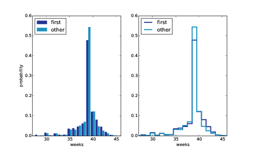
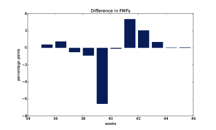
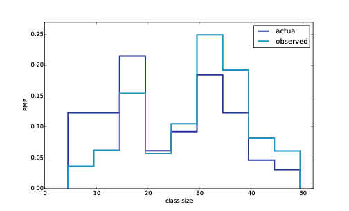

# Probability Mass Functions {#probability}


The code for this chapter is in `probability.py`. For information
about downloading and working with this code, see Section \@ref(using-the-code).


## PMFs

Another way to represent a distribution
is a **probability mass function**
(PMF), which maps from each value to its probability. A **probability** is a frequency expressed as
a fraction of the sample size, `n`. To get from frequencies to
probabilities, we divide through by `n`, which is called **normalization**. 

Given a `Hist`, we can make a dictionary
that maps from each value to its probability: 

    n = hist.Total()
    d = {}
    for x, freq in hist.Items():
        d[x] = freq / n

Or we can use the `Pmf` class provided by
`thinkstats2`. Like `Hist`, the
`Pmf` constructor can take a list, pandas Series, dictionary, Hist, or
another Pmf object. Here’s an example with a simple list:

    >>> import thinkstats2
    >>> pmf = thinkstats2.Pmf([1, 2, 2, 3, 5])
    >>> pmf
    Pmf({1: 0.2, 2: 0.4, 3: 0.2, 5: 0.2})

The `Pmf` is normalized so total probability is 1.

`Pmf` and `Hist` objects are similar in many
ways; in fact, they inherit many of their methods from a common parent
class. For example, the methods `Values` and `Items` work the same way for both.
The biggest difference is that a `Hist` maps from values to integer
counters; a `Pmf` maps from values to floating-point probabilities.

To look up the probability associated
with a value, use `Prob`:

    >>> pmf.Prob(2)
    0.4

The bracket operator is equivalent:

    >>> pmf[2]
    0.4

You can modify an existing `Pmf` by
incrementing the probability associated with a value:

    >>> pmf.Incr(2, 0.2)
    >>> pmf.Prob(2)
    0.6

Or you can multiply a probability by a
factor:

    >>> pmf.Mult(2, 0.5)
    >>> pmf.Prob(2)
    0.3

If you modify a `Pmf`, the result may not
be normalized; that is, the probabilities may no longer add up to 1. To
check, you can call `Total`,
which returns the sum of the probabilities:

    >>> pmf.Total()
    0.9

To renormalize, call `Normalize`:

    >>> pmf.Normalize()
    >>> pmf.Total()
    1.0

`Pmf` objects provide a `Copy` method so you can make and
modify a copy without affecting the original. 

My notation in this section might seem
inconsistent, but there is a system: I use `Pmf` for the name of the
class, `pmf` for an instance of
the class, and PMF for the mathematical concept of a probability mass
function.

## Plotting PMFs

`thinkplot` provides two ways to plot Pmfs:

-   To plot a Pmf as a bar graph, you can
    use `thinkplot.Hist`. Bar
    graphs are most useful if the number of values in the Pmf is small.
-   To plot a Pmf as a step function, you
    can use `thinkplot.Pmf`.
    This option is most useful if there are a large number of values and
    the Pmf is smooth. This function also works with Hist objects.

In addition, `pyplot` provides a function called
`hist` that takes a sequence of
values, computes a histogram, and plots it. Since I use `Hist` objects, I
usually don’t use `pyplot.hist`. 

```{r probability-nsfg-pmf, echo=F, out.width='90%', fig.align='center', fig.show='hold', fig.cap='PMF of pregnancy lengths for first babies and others, using bar graphs and step functions.'}

```

Figure [3.1](#probability-nsfg-pmf) shows PMFs of pregnancy length for first
babies and others using bar graphs (left) and step functions (right).

By plotting the PMF instead of the
histogram, we can compare the two distributions without being mislead by
the difference in sample size. Based on this figure, first babies seem
to be less likely than others to arrive on time (week 39) and more
likely to be a late (weeks 41 and 42).

Here’s the code that generates
Figure [3.1](#probability-nsfg-pmf)

        thinkplot.PrePlot(2, cols=2)
        thinkplot.Hist(first_pmf, align='right', width=width)
        thinkplot.Hist(other_pmf, align='left', width=width)
        thinkplot.Config(xlabel='weeks',
                         ylabel='probability',
                         axis=[27, 46, 0, 0.6])

        thinkplot.PrePlot(2)
        thinkplot.SubPlot(2)
        thinkplot.Pmfs([first_pmf, other_pmf])
        thinkplot.Show(xlabel='weeks',
                       axis=[27, 46, 0, 0.6])

`PrePlot` takes optional parameters
`rows` and `cols` to make a grid of figures, in
this case one row of two figures. The first figure (on the left)
displays the Pmfs using `thinkplot.Hist`, as we have seen
before. 

The second call to `PrePlot` resets the color generator.
Then `SubPlot` switches to the
second figure (on the right) and displays the Pmfs using `thinkplot.Pmfs`. I used the `axis` option to 
ensure that the two figures are on the same axes, which is generally a good idea if you
intend to compare two figures.

## Other Visualizations

Histograms and PMFs are useful while you
are exploring data and trying to identify patterns and relationships.
Once you have an idea what is going on, a good next step is to design a
visualization that makes the patterns you have identified as clear as
possible. 

In the NSFG data, the biggest differences
in the distributions are near the mode. So it makes sense to zoom in on
that part of the graph, and to transform the data to emphasize
differences: 

        weeks = range(35, 46)
        diffs = []
        for week in weeks:
            p1 = first_pmf.Prob(week)
            p2 = other_pmf.Prob(week)
            diff = 100 * (p1 - p2)
            diffs.append(diff)

        thinkplot.Bar(weeks, diffs)

In this code, `weeks` is the range of weeks; `diffs` is the difference between the
two PMFs in percentage points. Figure [3.2](#probability-nsfg-diffs) shows the result as a bar chart. This figure
makes the pattern clearer: first babies are less likely to be born in
week 39, and somewhat more likely to be born in weeks 41 and 42.

```{r probability-nsfg-diffs, echo=F, out.width='90%', fig.align='center', fig.show='hold', fig.cap='Difference, in percentage points, by week.'}

```

For now we should hold this conclusion
only tentatively. We used the same dataset to identify an apparent
difference and then chose a visualization that makes the difference
apparent. We can’t be sure this effect is real; it might be due to
random variation. We’ll address this concern later.


## The Class Size Paradox


Before we go on, I want to demonstrate
one kind of computation you can do with `Pmf` objects; I call this example
the “class size paradox.” 

At many American colleges and
universities, the student-to-faculty ratio is about 10:1. But students
are often surprised to discover that their average class size is bigger
than 10. There are two reasons for the discrepancy:

-   Students typically take 4–5 classes
    per semester, but professors often teach 1 or 2.
-   The number of students who enjoy a
    small class is small, but the number of students in a large class is
    (ahem!) large.

The first effect is obvious, at least
once it is pointed out; the second is more subtle. Let’s look at an
example. Suppose that a college offers 65 classes in a given semester,
with the following distribution of sizes:

     size      count
     5- 9          8
    10-14          8
    15-19         14
    20-24          4
    25-29          6
    30-34         12
    35-39          8
    40-44          3
    45-49          2

If you ask the Dean for the average class
size, he would construct a PMF, compute the mean, and report that the
average class size is 23.7. Here’s the code:

        d = { 7: 8, 12: 8, 17: 14, 22: 4, 
              27: 6, 32: 12, 37: 8, 42: 3, 47: 2 }

        pmf = thinkstats2.Pmf(d, label='actual')
        print('mean', pmf.Mean())

But if you survey a group of students,
ask them how many students are in their classes, and compute the mean,
you would think the average class was bigger. Let’s see how much
bigger.

First, I compute the distribution as
observed by students, where the probability associated with each class
size is “biased” by the number of students in the class. 

    def BiasPmf(pmf, label):
        new_pmf = pmf.Copy(label=label)

        for x, p in pmf.Items():
            new_pmf.Mult(x, x)
            
        new_pmf.Normalize()
        return new_pmf

For each class size, `x`, we multiply the probability by
`x`, the number of students who
observe that class size. The result is a new Pmf that represents the
biased distribution.

Now we can plot the actual and observed
distributions: 

        biased_pmf = BiasPmf(pmf, label='observed')
        thinkplot.PrePlot(2)
        thinkplot.Pmfs([pmf, biased_pmf])
        thinkplot.Show(xlabel='class size', ylabel='PMF')


```{r class-size1, echo=F, out.width='90%', fig.align='center', fig.show='hold', fig.cap='Distribution of class sizes, actual and as observed by students.'}

```

Figure [3.3](#class-size1) shows the result. In the biased distribution
there are fewer small classes and more large ones. The mean of the
biased distribution is 29.1, almost 25% higher than the actual
mean.

It is also possible to invert this
operation. Suppose you want to find the distribution of class sizes at a
college, but you can’t get reliable data from the Dean. An alternative
is to choose a random sample of students and ask how many students are
in their classes. 

The result would be biased for the
reasons we’ve just seen, but you can use it to estimate the actual
distribution. Here’s the function that unbiases a Pmf:</span>

    def UnbiasPmf(pmf, label):
        new_pmf = pmf.Copy(label=label)

        for x, p in pmf.Items():
            new_pmf.Mult(x, 1.0/x)
            
        new_pmf.Normalize()
        return new_pmf

It’s similar to `BiasPmf`; the only difference is
that it divides each probability by `x` instead of multiplying.


## DataFrame Indexing

In Section \@ref(dataframes) we read a pandas DataFrame and used it to
select and modify data columns. Now let’s look at row selection. To
start, I create a NumPy array of random numbers and use it to initialize
a DataFrame: 

    >>> import numpy as np
    >>> import pandas
    >>> array = np.random.randn(4, 2)
    >>> df = pandas.DataFrame(array)
    >>> df
              0         1
    0 -0.143510  0.616050
    1 -1.489647  0.300774
    2 -0.074350  0.039621
    3 -1.369968  0.545897

By default, the rows and columns are
numbered starting at zero, but you can provide column names:

    >>> columns = ['A', 'B']
    >>> df = pandas.DataFrame(array, columns=columns)
    >>> df
              A         B
    0 -0.143510  0.616050
    1 -1.489647  0.300774
    2 -0.074350  0.039621
    3 -1.369968  0.545897

You can also provide row names. The set
of row names is called the **index**
the row names themselves are called **labels**.

    >>> index = ['a', 'b', 'c', 'd']
    >>> df = pandas.DataFrame(array, columns=columns, index=index)
    >>> df
              A         B
    a -0.143510  0.616050
    b -1.489647  0.300774
    c -0.074350  0.039621
    d -1.369968  0.545897

As we saw in the previous chapter, simple
indexing selects a column, returning a Series: 

    >>> df['A']
    a   -0.143510
    b   -1.489647
    c   -0.074350
    d   -1.369968
    Name: A, dtype: float64

To select a row by label, you can use the
`loc` attribute, which returns
a Series:

    >>> df.loc['a']
    A   -0.14351
    B    0.61605
    Name: a, dtype: float64

If you know the integer position of a
row, rather than its label, you can use the `iloc` attribute, which also returns
a Series.

    >>> df.iloc[0]
    A   -0.14351
    B    0.61605
    Name: a, dtype: float64

`loc` can also take a list of labels;
in that case, the result is a DataFrame.

    >>> indices = ['a', 'c']
    >>> df.loc[indices]
             A         B
    a -0.14351  0.616050
    c -0.07435  0.039621

Finally, you can use a slice to select a
range of rows by label:

    >>> df['a':'c']
              A         B
    a -0.143510  0.616050
    b -1.489647  0.300774
    c -0.074350  0.039621

Or by integer position:

    >>> df[0:2]
              A         B
    a -0.143510  0.616050
    b -1.489647  0.300774

The result in either case is a DataFrame,
but notice that the first result includes the end of the slice; the
second doesn’t. 

My advice: if your rows have labels that
are not simple integers, use the labels consistently and avoid using
integer positions.


## Exercises

Solutions to these exercises are in
`chap03soln.ipynb` and `chap03soln.py`

**Exercise 1**

Something like the class
size paradox appears if you survey children and ask how many children
are in their family. Families with many children are more likely to
appear in your sample, and families with no children have no chance to
be in the sample. 

Use the NSFG respondent variable
`NUMKDHH` to construct the actual distribution for the number of
children under 18 in the household.

Now compute the biased distribution we
would see if we surveyed the children and asked them how many children
under 18 (including themselves) are in their household.

Plot the actual and biased
distributions, and compute their means. As a starting place, you can use
`chap03ex.ipynb`.

**Exercise 2**

In Section \@ref(summarizing-distributions) we computed the mean of a sample by adding up
the elements and dividing by n. If you are given a PMF, you can still
compute the mean, but the process is slightly different:

$$
\bar x = \sum_i p_ix_i
$$

*where the* $x_i$ *are the unique values in the PMF and* $p_i=PMF(x_i). Similarly, you can compute variance like
this:

$$
S^2 = \sum_i p_i (x_i - \bar x)^2
$$

Write functions called `PmfMean` and `PmfVar` that take a Pmf object and
compute the mean and variance. To test these methods, check that they
are consistent with the methods `Mean` and `Var` provided by Pmf.

**Exercise 3** 

I started with the
question, “Are first babies more likely to be late?” To address it, I
computed the difference in means between groups of babies, but I ignored
the possibility that there might be a difference between first babies
and others for the same woman.

To address this version of the question,
select respondents who have at least two babies and compute pairwise
differences. Does this formulation of the question yield a different
result?

*Hint: use `nsfg.MakePregMap`.*

**Exercise 4**

In most foot races, everyone starts at
the same time. If you are a fast runner, you usually pass a lot of
people at the beginning of the race, but after a few miles everyone
around you is going at the same speed.

When I ran a long-distance (209 miles)
relay race for the first time, I noticed an odd phenomenon: when I
overtook another runner, I was usually much faster, and when another
runner overtook me, he was usually much faster.

At first I thought that the distribution
of speeds might be bimodal; that is, there were many slow runners and
many fast runners, but few at my speed.

Then I realized that I was the victim of
a bias similar to the effect of class size. The race was unusual in two
ways: it used a staggered start, so teams started at different times;
also, many teams included runners at different levels of ability.

As a result, runners were spread out
along the course with little relationship between speed and location.
When I joined the race, the runners near me were (pretty much) a random
sample of the runners in the race.

So where does the bias come from? During
my time on the course, the chance of overtaking a runner, or being
overtaken, is proportional to the difference in our speeds. I am more
likely to catch a slow runner, and more likely to be caught by a fast
runner. But runners at the same speed are unlikely to see each
other.

Write a function called `ObservedPmf` that takes a Pmf
representing the actual distribution of runners’ speeds, and the speed
of a running observer, and returns a new Pmf representing the
distribution of runners’ speeds as seen by the observer.

To test your function, you can use `relay.py`, which reads the results
from the James Joyce Ramble 10K in Dedham MA and converts the pace of
each runner to mph.

Compute the distribution of speeds you
would observe if you ran a relay race at 7.5 mph with this group of
runners. A solution to this exercise is in `relay_soln.py`.


## Glossary

-   **Probability Mass Function (PMF)**: a
    representation of a distribution as a function that maps from values
    to probabilities. 
-   **probability**: A frequency expressed as
    a fraction of the sample size. 
-   **normalization**: The process of
    dividing a frequency by a sample size to get a probability.
-   **index**: In a pandas DataFrame, the
    index is a special column that contains the row labels. 
