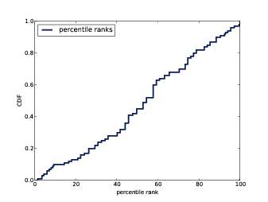

# Cumulative Distribution Functions {#cumulative}

The code for this chapter is in `cumulative.py`. For information
about downloading and working with this code, see Section \@ref(using-the-code).

## The Limits of PMFs

PMFs work well if the number of values is
small. But as the number of values increases, the probability associated
with each value gets smaller and the effect of random noise
increases.

For example, we might be interested in
the distribution of birth weights. In the NSFG data, the variable
`totalwgt_lb` records weight at birth in pounds. Figure [4.1](#nsfg-birthwgt-pmf) 
shows the PMF of these values for first babies and others. 

```{r nsfg-birthwgt-pmf, echo=F, out.width='90%', fig.align='center', fig.show='hold', fig.cap='PMF of birth weights. This figure shows a limitation of PMFs: they are hard to compare visually.'}
knitr::include_graphics("images/09.png")
```

Overall, these distributions resemble the
bell shape of a normal distribution, with many values near the mean and
a few values much higher and lower.

But parts of this figure are hard to
interpret. There are many spikes and valleys, and some apparent
differences between the distributions. It is hard to tell which of these
features are meaningful. Also, it is hard to see overall patterns; for
example, which distribution do you think has the higher mean?

These problems can be mitigated by
binning the data; that is, dividing the range of values into
non-overlapping intervals and counting the number of values in each bin.
Binning can be useful, but it is tricky to get the size of the bins
right. If they are big enough to smooth out noise, they might also
smooth out useful information.

An alternative that avoids these problems
is the cumulative distribution function (CDF), which is the subject of
this chapter. But before I can explain CDFs, I have to explain
percentiles. 


## Percentiles

If you have taken a standardized test,
you probably got your results in the form of a raw score and a **percentile** rank. 
In this context, the percentile rank is the fraction of people who scored lower than you (or
the same). So if you are “in the 90th percentile,” you did as well as or
better than 90% of the people who took the exam.

Here’s how you could compute the
percentile rank of a value, `your_score`, relative to the values in the
sequence `scores`: 

    def PercentileRank(scores, your_score):
        count = 0
        for score in scores:
            if score <= your_score:
                count += 1

        percentile_rank = 100.0 * count / len(scores)
        return percentile_rank

As an example, if the scores in the
sequence were 55, 66, 77, 88 and 99, and you got the 88, then your
percentile rank would be `100 * 4 /
5` which is 80.

If you are given a value, it is easy to
find its percentile rank; going the other way is slightly harder. If you
are given a percentile rank and you want to find the corresponding
value, one option is to sort the values and search for the one you want:

    def Percentile(scores, percentile_rank):
        scores.sort()
        for score in scores:
            if PercentileRank(scores, score) >= percentile_rank:
                return score

The result of this calculation is a **percentile**. For example, the 50th
percentile is the value with percentile rank 50. In the distribution of
exam scores, the 50th percentile is 77. 

This implementation of `Percentile` is not efficient. A
better approach is to use the percentile rank to compute the index of
the corresponding percentile:

    def Percentile2(scores, percentile_rank):
        scores.sort()
        index = percentile_rank * (len(scores)-1) // 100
        return scores[index]

The difference between “percentile” and
“percentile rank” can be confusing, and people do not always use the
terms precisely. To summarize, `PercentileRank` takes a value and
computes its percentile rank in a set of values; `Percentile` takes a percentile rank
and computes the corresponding value. 


## CDFs

Now that we understand percentiles and
percentile ranks, we are ready to tackle the **cumulative distribution function** (CDF).
The CDF is the function that maps from a value to its percentile rank.

The CDF is a function of $x$, where $x$ is any value that might appear in the
distribution. To evaluate $CDF(x)$ for a particular value of $x$, we compute the fraction of values in
the distribution less than or equal to $x$.

Here’s what that looks like as a function
that takes a sequence, `sample`, and a value, `x`:

    def EvalCdf(sample, x):
        count = 0.0
        for value in sample:
            if value <= x:
                count += 1

        prob = count / len(sample)
        return prob

This function is almost identical to
`PercentileRank`, except that
the result is a probability in the range 0–1 rather than a percentile
rank in the range 0–100. 

As an example, suppose we collect a
sample with the values `[1, 2, 2, 3,
5]`. Here are some values from its CDF:

$$
CDF(0) = 0
$$

$$
CDF(1) = 0.2
$$

$$
CDF(2) = 0.6
$$

$$
CDF(3) = 0.8
$$

$$
CDF(4) = 0.8
$$

$$
CDF(5) = 1
$$


We can evaluate the CDF for any value of
$x$, not just values that appear in
the sample. If $x$ is less than the
smallest value in the sample, $CDF(x)$ is 0. If $x$ is greater than the largest value,
$CDF(x)$ is 1.

```{r example-cdf, echo=F, out.width='90%', fig.align='center', fig.show='hold', fig.cap='Example of a CDF.'}
knitr::include_graphics("images/10.png")
```

Figure [4.2](#example-cdf) is a graphical representation of this CDF. The
CDF of a sample is a step function.


## Representing CDFs


`thinkstats2` provides a class named
Cdf that represents CDFs. The fundamental methods Cdf provides
are:

-   `Prob(x)`: Given a value `x`, computes the probability
    $p = CDF(x)$. The bracket operator is
    equivalent to `Prob`
-   `Value(p)`: Given a probability `p`, computes the
    corresponding value, `x`; that is, the **inverse CDF** of `p`.

```{r cumulative-prglngth-cdf, echo=F, out.width='90%', fig.align='center', fig.show='hold', fig.cap='CDF of pregnancy length.'}

```

The Cdf constructor can take as an
argument a list of values, a pandas Series, a Hist, Pmf, or another Cdf.
The following code makes a Cdf for the distribution of pregnancy lengths
in the NSFG: 

        live, firsts, others = first.MakeFrames()
        cdf = thinkstats2.Cdf(live.prglngth, label='prglngth')

`thinkplot` provides a function named `Cdf` that plots Cdfs as lines:

        thinkplot.Cdf(cdf)
        thinkplot.Show(xlabel='weeks', ylabel='CDF')

Figure [4.3](#cumulative-prglngth-cdf) shows the result. One way to read a CDF is to
look up percentiles. For example, it looks like about 10% of pregnancies
are shorter than 36 weeks, and about 90% are shorter than 41 weeks. The
CDF also provides a visual representation of the shape of the
distribution. Common values appear as steep or vertical sections of the
CDF; in this example, the mode at 39 weeks is apparent. There are few
values below 30 weeks, so the CDF in this range is flat. 

It takes some time to get used to CDFs,
but once you do, I think you will find that they show more information,
more clearly, than PMFs.

## Comparing CDFs


CDFs are especially useful for comparing
distributions. For example, here is the code that plots the CDF of birth
weight for first babies and others. 

        first_cdf = thinkstats2.Cdf(firsts.totalwgt_lb, label='first')
        other_cdf = thinkstats2.Cdf(others.totalwgt_lb, label='other')

        thinkplot.PrePlot(2)
        thinkplot.Cdfs([first_cdf, other_cdf])
        thinkplot.Show(xlabel='weight (pounds)', ylabel='CDF')

```{r cumulative-birthwgt-cdf, echo=F, out.width='90%', fig.align='center', fig.show='hold', fig.cap='CDF of birth weights for first babies and others.'}

```

Figure [4.4](#cumulative-birthwgt-cdf) shows the result. Compared to
Figure [4.1](#nsfg-birthwgt-pmf), this figure makes the shape of the
distributions, and the differences between them, much clearer. We can
see that first babies are slightly lighter throughout the distribution,
with a larger discrepancy above the mean. 


## Percentile-based Statistics


Once you have computed a CDF, it is easy
to compute percentiles and percentile ranks. The Cdf class provides
these two methods: 

-   `PercentileRank(x)`: Given a
    value `x`, computes its
    percentile rank, $100 * CDF(x)$.
-   `Percentile(p)`: Given a
    percentile rank `p`,
    computes the corresponding value, `x`. Equivalent to `Value(p/100)`.

`Percentile` can be used to compute
percentile-based summary statistics. For example, the 50th percentile is
the value that divides the distribution in half, also known as the **median**. Like the mean, the median is a
measure of the central tendency of a distribution.

Actually, there are several definitions
of “median,” each with different properties. But `Percentile(50)` is simple and
efficient to compute.

Another percentile-based statistic is the
**interquartile range** (IQR), which
is a measure of the spread of a distribution. The IQR is the difference
between the 75th and 25th percentiles.

More generally, percentiles are often
used to summarize the shape of a distribution. For example, the
distribution of income is often reported in “quintiles”; that is, it is
split at the 20th, 40th, 60th and 80th percentiles. Other distributions
are divided into ten “deciles”. Statistics like these that represent
equally-spaced points in a CDF are called **quantiles**. For more, see [https://en.wikipedia.org/wiki/Quantile](https://en.wikipedia.org/wiki/Quantile)


## Random Numbers


Suppose we choose a random sample from
the population of live births and look up the percentile rank of their
birth weights. Now suppose we compute the CDF of the percentile ranks.
What do you think the distribution will look like? 

Here’s how we can compute it. First, we
make the Cdf of birth weights: 

        weights = live.totalwgt_lb
        cdf = thinkstats2.Cdf(weights, label='totalwgt_lb')

Then we generate a sample and compute the
percentile rank of each value in the sample.

        sample = np.random.choice(weights, 100, replace=True)
        ranks = [cdf.PercentileRank(x) for x in sample]

`sample` is a random sample of 100
birth weights, chosen with **replacement**; that is, the same value
could be chosen more than once. `ranks` is a list of percentile
ranks.

Finally we make and plot the Cdf of the percentile ranks.

        rank_cdf = thinkstats2.Cdf(ranks)
        thinkplot.Cdf(rank_cdf)
        thinkplot.Show(xlabel='percentile rank', ylabel='CDF')

```{r cumulative-random, echo=F, out.width='90%', fig.align='center', fig.show='hold', fig.cap='CDF of percentile ranks for a random sample of birth weights.'}

```

Figure [4.5](#cumulative-random) shows the result. The CDF is approximately a
straight line, which means that the distribution is uniform.

That outcome might be non-obvious, but it
is a consequence of the way the CDF is defined. What this figure shows
is that 10% of the sample is below the 10th percentile, 20% is below the
20th percentile, and so on, exactly as we should expect.

So, regardless of the shape of the CDF,
the distribution of percentile ranks is uniform. This property is
useful, because it is the basis of a simple and efficient algorithm for
generating random numbers with a given CDF. Here’s how: 

-   Choose a percentile rank uniformly from the range 0–100.
-   Use `Cdf.Percentile` to find the
    value in the distribution that corresponds to the percentile rank
    you chose.

Cdf provides an implementation of this
algorithm, called `Random`:

    # class Cdf:
        def Random(self):
            return self.Percentile(random.uniform(0, 100))

Cdf also provides `Sample`, which takes an integer,`n`, and returns a list of
`n` values chosen at random from the Cdf.


## Comparing Percentile Ranks


Percentile ranks are useful for comparing
measurements across different groups. For example, people who compete in
foot races are usually grouped by age and gender. To compare people in
different age groups, you can convert race times to percentile ranks.

A few years ago I ran the James Joyce
Ramble 10K in Dedham MA; I finished in 42:44, which was 97th in a field
of 1633. I beat or tied 1537 runners out of 1633, so my percentile rank
in the field is 94%. 

More generally, given position and field
size, we can compute percentile rank: 

    def PositionToPercentile(position, field_size):
        beat = field_size - position + 1
        percentile = 100.0 * beat / field_size
        return percentile

In my age group, denoted M4049 for “male
between 40 and 49 years of age”, I came in 26th out of 256. So my
percentile rank in my age group was 90%. 

If I am still running in 10 years (and I
hope I am), I will be in the M5059 division. Assuming that my percentile
rank in my division is the same, how much slower should I expect to
be?

I can answer that question by converting
my percentile rank in M4049 to a position in M5059. Here’s the
code:

    def PercentileToPosition(percentile, field_size):
        beat = percentile * field_size / 100.0
        position = field_size - beat + 1
        return position

There were 171 people in M5059, so I
would have to come in between 17th and 18th place to have the same
percentile rank. The finishing time of the 17th runner in M5059 was
46:05, so that’s the time I will have to beat to maintain my percentile
rank.


## Exercises


For the following exercises, you can start with `chap04ex.ipynb`. My solution is in
`chap04soln.ipynb`.

**Exercise 1**   

How much did you weigh at
birth? If you don’t know, call your mother or someone else who knows.
Using the NSFG data (all live births), compute the distribution of birth
weights and use it to find your percentile rank. If you were a first
baby, find your percentile rank in the distribution for first babies.
Otherwise use the distribution for others. If you are in the 90th
percentile or higher, call your mother back and apologize.

**Exercise 2**

The numbers generated by `random.random` are supposed to
be uniform between 0 and 1; that is, every value in the range should
have the same probability.

Generate 1000 numbers from `random.random` and plot their PMF
and CDF. Is the distribution uniform?


## Glossary

-   **percentile rank**: The percentage of
    values in a distribution that are less than or equal to a given
    value. 
-   **percentile**: The value associated with
    a given percentile rank. 
-   **cumulative distribution function (CDF)**: A function that maps from values to their cumulative
    probabilities. $CDF(x)$ is the fraction of the sample
    less than or equal to $x$.
-   **inverse CDF**: A function that maps
    from a cumulative probability, $p$, to the corresponding value.
-   **median**: The 50th percentile, often
    used as a measure of central tendency. 
-   **interquartile range**: The difference
    between the 75th and 25th percentiles, used as a measure of spread.
-   **quantile**: A sequence of values that
    correspond to equally spaced percentile ranks; for example, the
    quartiles of a distribution are the 25th, 50th and 75th percentiles.
-   **replacement**: A property of a sampling
    process. “With replacement” means that the same value can be chosen
    more than once; “without replacement” means that once a value is
    chosen, it is removed from the population. 
