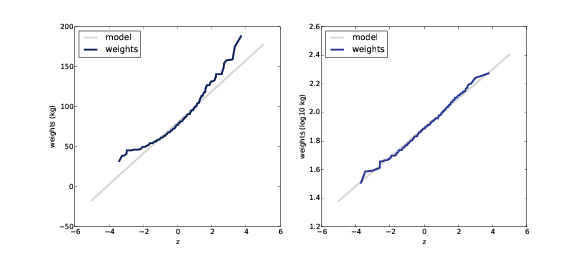

# Modeling Distributions {#modeling}


The distributions we have used so far are
called **empirical distributions**
because they are based on empirical observations, which are necessarily
finite samples. 

The alternative is an **analytic distribution**, which is
characterized by a CDF that is a mathematical function. Analytic
distributions can be used to model empirical distributions. In this
context, a **model** is a
simplification that leaves out unneeded details. This chapter presents
common analytic distributions and uses them to model data from a variety
of sources. 

The code for this chapter is in `analytic.py`. For information about
downloading and working with this code, see Section \@ref(using-the-code).


## The Exponential Distribution


```{r analytic-expo-cdf, echo=F, out.width='90%', fig.align='center', fig.show='hold', fig.cap='CDFs of exponential distributions with various parameters.'}
knitr::include_graphics("images/14.png")
```

I’ll start with the **exponential distribution** because it is
relatively simple. The CDF of the exponential distribution is

$$
CDF(x) = 1 - e^{\lambda x}
$$


The parameter, $\lambda$, determines the shape
of the distribution. Figure [5.1](#analytic-expo-cdf) shows what this CDF looks like with $\lambda$ = 0.5,
1, and 2. 

In the real world, exponential
distributions come up when we look at a series of events and measure the
times between events, called **interarrival
times**. If the events are equally likely to occur at any time, the
distribution of interarrival times tends to look like an exponential
distribution. 

As an example, we will look at the
interarrival time of births. On December 18, 1997, 44 babies were born
in a hospital in Brisbane,
Australia. ^[This example is based on information and data from Dunn, “A Simple
Dataset for Demonstrating Common Distributions,” Journal of Statistics
Education v.7, n.3 (1999).] The time of birth for all 44 babies was
reported in the local paper; the complete dataset is in a file called
`babyboom.dat`, in the `ThinkStats2` repository.

        df = ReadBabyBoom()
        diffs = df.minutes.diff()
        cdf = thinkstats2.Cdf(diffs, label='actual')

        thinkplot.Cdf(cdf)
        thinkplot.Show(xlabel='minutes', ylabel='CDF')

`ReadBabyBoom` reads the data file
and returns a DataFrame with columns `time`, `sex`, `weight_g`, and `minutes`, where `minutes` is time of birth converted
to minutes since midnight. 

```{r analytic-interarrival-cdf, echo=F, out.width='90%', fig.align='center', fig.show='hold', fig.cap='CDF of interarrival times (left) and CCDF on a log-y scale (right)'}

```


`diffs` is the difference between
consecutive birth times, and `cdf` is the distribution of these
interarrival times. Figure [5.2](#analytic-interarrival-cdf) (left) shows the CDF. It seems to have the
general shape of an exponential distribution, but how can we
tell?

One way is to plot the **complementary CDF**, which is $1 − CDF(x)$, on a log-y scale. For data from an
exponential distribution, the result is a straight line. Let’s see why
that works. 

If you plot the complementary CDF (CCDF)
of a dataset that you think is exponential, you expect to see a function
like: 

$$
y \approx e^{-\lambda x}
$$


Taking the log of both sides yields:

$$
logy \approx \lambda x
$$

So on a log-y scale the CCDF is a
straight line with slope $-\lambda$. Here’s how we can generate a plot like
that: 

        thinkplot.Cdf(cdf, complement=True)
        thinkplot.Show(xlabel='minutes',
                       ylabel='CCDF',
                       yscale='log')

With the argument `complement=True`, `thinkplot.Cdf` computes the
complementary CDF before plotting. And with `yscale=’log’`, `thinkplot.Show` sets the `y` axis to a logarithmic scale.

Figure [5.2](#analytic-interarrival-cdf) (right) shows the result. It is not exactly
straight, which indicates that the exponential distribution is not a
perfect model for this data. Most likely the underlying assumption—that
a birth is equally likely at any time of day—is not exactly true.
Nevertheless, it might be reasonable to model this dataset with an
exponential distribution. With that simplification, we can summarize the
distribution with a single parameter. 

The parameter, $\lambda$, can be interpreted as a
rate; that is, the number of events that occur, on average, in a unit of
time. In this example, 44 babies are born in 24 hours, so the rate is λ
= 0.0306 births per minute. The mean of an exponential distribution is
1/λ, so the mean time between births is 32.7 minutes.


## The Normal Distribution


The **normal
distribution**, also called Gaussian, is commonly used because it
describes many phenomena, at least approximately. It turns out that
there is a good reason for its ubiquity, which we will get to in
Section \@ref(CLT). 

```{r analytic-gaussian-cdf, echo=F, out.width='90%', fig.align='center', fig.show='hold', fig.cap='CDF of normal distributions with a range of parameters.'}
knitr::include_graphics("images/16.png")
```

The normal distribution is characterized
by two parameters: the mean, µ, and standard deviation σ. The normal
distribution with µ=0 and σ=1 is called the **standard normal distribution**. Its CDF is
defined by an integral that does not have a closed form solution, but
there are algorithms that evaluate it efficiently. One of them is
provided by SciPy: `scipy.stats.norm` is an object that
represents a normal distribution; it provides a method, `cdf`, that evaluates the standard
normal CDF: 

    >>> import scipy.stats
    >>> scipy.stats.norm.cdf(0)
    0.5

This result is correct: the median of the
standard normal distribution is 0 (the same as the mean), and half of
the values fall below the median, so $CDF(0)$ is 0.5.

`norm.cdf` takes optional parameters:
`loc`, which specifies the mean, and `scale`, which specifies the standard deviation.

`thinkstats2` makes this function a
little easier to use by providing `EvalNormalCdf`, which takes
parameters `mu` and `sigma` and evaluates the CDF at
`x`:

    def EvalNormalCdf(x, mu=0, sigma=1):
        return scipy.stats.norm.cdf(x, loc=mu, scale=sigma)

Figure [5.3](#analytic-gaussian-cdf) shows CDFs for normal distributions with a
range of parameters. The sigmoid shape of these curves is a recognizable
characteristic of a normal distribution.

In the previous chapter we looked at the
distribution of birth weights in the NSFG. Figure [5.4](#analytic-birthwgt-model) shows the empirical CDF of weights for all
live births and the CDF of a normal distribution with the same mean and
variance. 

```{r analytic-birthwgt-model, echo=F, out.width='90%', fig.align='center', fig.show='hold', fig.cap='CDF of birth weights with a normal model.'}

```

The normal distribution is a good model
for this dataset, so if we summarize the distribution with the
parameters $\mu$ = 7.28 and $\sigma$ = 1.24, the resulting error (difference
between the model and the data) is small. 

Below the 10th percentile there is a
discrepancy between the data and the model; there are more light babies
than we would expect in a normal distribution. If we are specifically
interested in preterm babies, it would be important to get this part of
the distribution right, so it might not be appropriate to use the normal
model.


## Normal Probability Plot

For the exponential distribution, and a
few others, there are simple transformations we can use to test whether
an analytic distribution is a good model for a dataset. 

For the normal distribution there is no
such transformation, but there is an alternative called a **normal probability plot**. There are two
ways to generate a normal probability plot: the hard way and the easy
way. If you are interested in the hard way, you can read about it at
[https://en.wikipedia.org/wiki/Normal\_probability\_plot](https://en.wikipedia.org/wiki/Normal_probability_plot). Here’s the easy way: 

1.  Sort the values in the sample.
2.  From a standard normal distribution
    ($\mu$=0 and $\sigma$=1), generate a random sample with the same size as the
    sample, and sort it. 
3.  Plot the sorted values from the sample versus the random values.

If the distribution of the sample is
approximately normal, the result is a straight line with intercept `mu` and slope `sigma`. 
`thinkstats2` provides `NormalProbability`, which takes a
sample and returns two NumPy arrays: 

    xs, ys = thinkstats2.NormalProbability(sample)

```{r analytic-normal-prob-example, echo=F, out.width='90%', fig.align='center', fig.show='hold', fig.cap='Normal probability plot for random samples from normal distributions.'}

```


`ys` contains the sorted values from `sample`; `xs` contains the random values from
the standard normal distribution.

To test `NormalProbability` I generated some
fake samples that were actually drawn from normal distributions with
various parameters. Figure [5.5](#analytic-normal-prob-example) shows the results. The lines are approximately
straight, with values in the tails deviating more than values near the
mean.

Now let’s try it with real data. Here’s
code to generate a normal probability plot for the birth weight data
from the previous section. It plots a gray line that represents the
model and a blue line that represents the data. 

    def MakeNormalPlot(weights):
        mean = weights.mean()
        std = weights.std()

        xs = [-4, 4]
        fxs, fys = thinkstats2.FitLine(xs, inter=mean, slope=std)
        thinkplot.Plot(fxs, fys, color='gray', label='model')

        xs, ys = thinkstats2.NormalProbability(weights)
        thinkplot.Plot(xs, ys, label='birth weights')

`weights` is a pandas Series of birth
weights; `mean` and `std` are the mean and standard
deviation. 

`FitLine` takes a sequence of `xs`, an intercept, and a slope; it
returns `xs` and `ys` that represent a line with the
given parameters, evaluated at the values in `xs`.

`NormalProbability` returns `xs` and `ys` that contain values from the
standard normal distribution and values from `weights`. If the distribution of
weights is normal, the data should match the model. 

```{r analytic-birthwgt-normal, echo=F, out.width='90%', fig.align='center', fig.show='hold', fig.cap='Normal probability plot of birth weights.'}

```

Figure [5.6](#analytic-birthwgt-normal) shows the results for all live births, and
also for full term births (pregnancy length greater than 36 weeks). Both
curves match the model near the mean and deviate in the tails. The
heaviest babies are heavier than what the model expects, and the
lightest babies are lighter. 

When we select only full term births, we
remove some of the lightest weights, which reduces the discrepancy in
the lower tail of the distribution.

This plot suggests that the normal model
describes the distribution well within a few standard deviations from
the mean, but not in the tails. Whether it is good enough for practical
purposes depends on the purposes. 

## The Lognormal Distribution


If the logarithms of a set of values have
a normal distribution, the values have a **lognormal distribution**. The CDF of the
lognormal distribution is the same as the CDF of the normal
distribution, with $logx$
substituted for $x$.

$$
CDF_{lognormal}(x) = CDF_{normal}(logx)
$$


The parameters of the lognormal
distribution are usually denoted $\mu$ and $\sigma$. But remember that these
parameters are *not* the mean and standard deviation; the mean of a
lognormal distribution is $exp (\mu + {\sigma^2 \over 2})$ and the standard deviation is ugly (see
[http://wikipedia.org/wiki/Log-normal\_distribution](http://wikipedia.org/wiki/Log-normal_distribution)). 

```{r brfss-weight, echo=F, out.width='90%', fig.align='center', fig.show='hold', fig.cap='CDF of adult weights on a linear scale (left) and log scale (right)'}

```

If a sample is approximately lognormal
and you plot its CDF on a log-x scale, it will have the characteristic
shape of a normal distribution. To test how well the sample fits a
lognormal model, you can make a normal probability plot using the log of
the values in the sample. 

As an example, let’s look at the
distribution of adult weights, which is approximately
lognormal. ^[I was tipped off to this possibility by a comment (without citation) at
[http://mathworld.wolfram.com/LogNormalDistribution.html](http://mathworld.wolfram.com/LogNormalDistribution.html).
Subsequently I found a paper that proposes the log transform and
suggests a cause: Penman and Johnson, “The Changing Shape of the Body
Mass Index Distribution Curve in the Population,” Preventing Chronic
Disease, 2006 July; 3(3): A74. Online at [http://www.ncbi.nlm.nih.gov/pmc/articles/PMC1636707](http://www.ncbi.nlm.nih.gov/pmc/articles/PMC1636707).]

The National Center for Chronic Disease
Prevention and Health Promotion conducts an annual survey as part of the
Behavioral Risk Factor Surveillance System
(BRFSS). ^[Centers for Disease Control and Prevention (CDC). Behavioral Risk Factor
Surveillance System Survey Data. Atlanta, Georgia: U.S. Department of
Health and Human Services, Centers for Disease Control and
Prevention, 2008.]

In 2008, they interviewed 414,509 respondents
and asked about their demographics, health, and health risks. Among the
data they collected are the weights in kilograms of 398,484 respondents.

The repository for this book contains
`CDBRFS08.ASC.gz`, a
fixed-width ASCII file that contains data from the BRFSS, and `brfss.py`, which reads the file and
analyzes the data.

```{r brfss-weight-normal, echo=F, out.width='90%', fig.align='center', fig.show='hold', fig.cap='Normal probability plots for adult weight on a linear scale (left) and log scale (right).'}

```

Figure [5.7</span>](#brfss-weight) (left) shows the distribution of adult weights
on a linear scale with a normal model. Figure [5.7](#brfss-weight) (right) shows the same distribution on a log
scale with a lognormal model. The lognormal model is a better fit, but
this representation of the data does not make the difference
particularly dramatic. 

Figure [5.8](#brfss-weight-normal) shows normal probability plots for adult
weights, $w$, and for their logarithms, $log_10{w}$. Now it is apparent that the
data deviate substantially from the normal model. On the other hand, the
lognormal model is a good match for the data. 


## The Pareto Distribution


The **Pareto
distribution** is named after the economist Vilfredo Pareto, who
used it to describe the distribution of wealth (see [http://wikipedia.org/wiki/Pareto\_distribution](http://wikipedia.org/wiki/Pareto_distribution)). Since then, it has been used to describe
phenomena in the natural and social sciences including sizes of cities
and towns, sand particles and meteorites, forest fires and earthquakes.

The CDF of the Pareto distribution is:

$$
CDF(x) = 1 - \Bigg({x \over x_m}\Bigg)^{-\alpha}
$$


The parameters $x_m$ and $\alpha$ determine the location and shape of the
distribution. $x_m$ is the minimum possible value.
Figure [5.9](#analytic-pareto-cdf) shows CDFs of Pareto distributions with $x_m$ = 0.5 
and different values of $\alpha$. 

```{r analytic-pareto-cdf, echo=F, out.width='90%', fig.align='center', fig.show='hold', fig.cap='CDFs of Pareto distributions with different parameters.'}
knitr::include_graphics("images/22.png")
```

There is a simple visual test that
indicates whether an empirical distribution fits a Pareto distribution:
on a log-log scale, the CCDF looks like a straight line. Let’s see why
that works.

If you plot the CCDF of a sample from a
Pareto distribution on a linear scale, you expect to see a function
like:

$$
y \approx \Bigg({x \over x_m} \Bigg)^{-\alpha}
$$

Taking the log of both sides yields:

$$
logy \approx -\alpha(logx - logx_m) 
$$


So if you plot $logy$ versus $logx$, it should look like a straight line
with slope $-\alpha$ and intercept $\alpha logx_m$.

As an example, let’s look at the sizes of
cities and towns. The U.S. Census Bureau publishes the population of
every incorporated city and town in the United States. 

```{r populations-pareto, echo=F, out.width='90%', fig.align='center', fig.show='hold', fig.cap='CCDFs of city and town populations, on a log-log scale.'}

```

I downloaded their data from
[http://www.census.gov/popest/data/cities/totals/2012/SUB-EST2012-3.html](http://www.census.gov/popest/data/cities/totals/2012/SUB-EST2012-3.html); it is in the repository for this book in a
file named `PEP_2012_PEPANNRES_with_ann.csv`. The repository also
contains `populations.py`,
which reads the file and plots the distribution of populations.

Figure [5.10](#populations-pareto) shows the CCDF of populations on a log-log
scale. The largest 1% of cities and towns, below $10^-2$,
fall along a straight line. So we could conclude, as some researchers
have, that the tail of this distribution fits a Pareto model.

On the other hand, a lognormal
distribution also models the data well. Figure [5.11](#populations-normal) shows the CDF of populations and a lognormal
model (left), and a normal probability plot (right). Both plots show
good agreement between the data and the model. 

Neither model is perfect. The Pareto
model only applies to the largest 1% of cities, but it is a better fit
for that part of the distribution. The lognormal model is a better fit
for the other 99%. Which model is appropriate depends on which part of
the distribution is relevant.

```{r populations-normal, echo=F, out.width='90%', fig.align='center', fig.show='hold', fig.cap='CDF of city and town populations on a log-x scale (left), and normal probability plot of log-transformed populations (right).'}

```


## Generating Random Numbers


Analytic CDFs can be used to generate
random numbers with a given distribution function, $p = CDF(x)$. If there is an efficient way to
compute the inverse CDF, we can generate random values with the
appropriate distribution by choosing $p$ from a uniform distribution between 0
and 1, then choosing $x = ICDF(p). 

For example, the CDF of the exponential
distribution is 

$$
p = 1 - e^{-\lambda x}
$$

Solving for $x$ yields: 

$$
x = {-log(1-p) \over \lambda}
$$

So in Python we can write 

    def expovariate(lam):
        p = random.random()
        x = -math.log(1-p) / lam
        return x

`expovariate` takes `lam` and returns a random value
chosen from the exponential distribution with parameter `lam`.

Two notes about this implementation: I
called the parameter `lam` because `lambda` is a Python keyword. Also,
since log0 is undefined, we have to be a little careful. The
implementation of `random.random` can return 0 but not
1, so $1 − p$ can be 1 but not 0,
so `log(1-p)` is always
defined. 


## Why Model?


At the beginning of this chapter, I said
that many real world phenomena can be modeled with analytic
distributions. “So,” you might ask, “what?” 

Like all models, analytic distributions
are abstractions, which means they leave out details that are considered
irrelevant. For example, an observed distribution might have measurement
errors or quirks that are specific to the sample; analytic models smooth
out these idiosyncrasies. 

Analytic models are also a form of data
compression. When a model fits a dataset well, a small set of parameters
can summarize a large amount of data. 

It is sometimes surprising when data from
a natural phenomenon fit an analytic distribution, but these
observations can provide insight into physical systems. Sometimes we can
explain why an observed distribution has a particular form. For example,
Pareto distributions are often the result of generative processes with
positive feedback (so-called preferential attachment processes: see
[http://wikipedia.org/wiki/Preferential\_attachment](http://wikipedia.org/wiki/Preferential_attachment)). 

Also, analytic distributions lend
themselves to mathematical analysis, as we will see in
Chapter \@ref(analysis).

But it is important to remember that all
models are imperfect. Data from the real world never fit an analytic
distribution perfectly. People sometimes talk as if data are generated
by models; for example, they might say that the distribution of human
heights is normal, or the distribution of income is lognormal. Taken
literally, these claims cannot be true; there are always differences
between the real world and mathematical models.

Models are useful if they capture the
relevant aspects of the real world and leave out unneeded details. But
what is “relevant” or “unneeded” depends on what you are planning to use
the model for.


## Exercises


For the following exercises, you can start with `chap05ex.ipynb`. My solution is in `chap05soln.ipynb`.

**Exercise 1** 

In the BRFSS (see
Section \@ref(lognormal), the distribution of heights is roughly
normal with parameters $\mu$ = 178 cm and $\sigma$ = 7.7 cm for men, and $\mu$ =
163 cm and $\sigma$ = 7.3 cm for women. 

In order to join Blue Man Group, you
have to be male between 5’10” and 6’1” (see[http://bluemancasting.com](http://bluemancasting.com)). What percentage of the U.S. male population
is in this range? Hint: use `scipy.stats.norm.cdf`.

**Exercise 2**

To get a feel for the
Pareto distribution, let’s see how different the world would be if the
distribution of human height were Pareto. With the parameters $x_m = 1 m and $\alpha$ = 1.7, we get a distribution
with a reasonable minimum, 1 m, and median, 1.5 m.

Plot this distribution. What is the mean
human height in Pareto world? What fraction of the population is shorter
than the mean? If there are 7 billion people in Pareto world, how many
do we expect to be taller than 1 km? How tall do we expect the tallest
person to be?

**Exercise 3**

The Weibull distribution is a
generalization of the exponential distribution that comes up in failure
analysis (see [http://wikipedia.org/wiki/Weibull\_distribution](http://wikipedia.org/wiki/Weibull_distribution). Its CDF is

$$
CDF(x) = 1 - e^{({x \over \lambda})^k}
$$


Can you find a transformation that
makes a Weibull distribution look like a straight line? What do the
slope and intercept of the line indicate?

Use `random.weibullvariate` to generate a
sample from a Weibull distribution and use it to test your
transformation.

**Exercise 4**   

For small values of $n$, we don’t expect an empirical
distribution to fit an analytic distribution exactly. One way to
evaluate the quality of fit is to generate a sample from an analytic
distribution and see how well it matches the data.

For example, in Section \@ref(exponential) we plotted the distribution of time between
births and saw that it is approximately exponential. But the
distribution is based on only 44 data points. To see whether the data
might have come from an exponential distribution, generate 44 values
from an exponential distribution with the same mean as the data, about
33 minutes between births.

Plot the distribution of the random
values and compare it to the actual distribution. You can use `random.expovariate` to generate the
values.

**Exercise 5**   

In the repository for this
book, you’ll find a set of data files called `mystery0.dat`, `mystery1.dat`, and so on. Each
contains a sequence of random numbers generated from an analytic
distribution.

You will also find `test_models.py`, a
script that reads data from a file and plots the CDF under a variety of
transforms. You can run it like this:

    $ python test_models.py mystery0.dat

Based on these plots, you should be able
to infer what kind of distribution generated each file. If you are
stumped, you can look in `mystery.py`, which contains the code
that generated the files.

**Exercise 6**

The distributions of wealth and income
are sometimes modeled using lognormal and Pareto distributions. To see
which is better, let’s look at some data.

The Current Population Survey (CPS) is a
joint effort of the Bureau of Labor Statistics and the Census Bureau to
study income and related variables. Data collected in 2013 is available
from [http://www.census.gov/hhes/www/cpstables/032013/hhinc/toc.htm](http://www.census.gov/hhes/www/cpstables/032013/hhinc/toc.htm). I downloaded `hinc06.xls`, which is an Excel
spreadsheet with information about household income, and converted it to
`hinc06.csv`, a CSV file you
will find in the repository for this book. You will also find `hinc.py`, which reads this
file.

Extract the distribution of incomes from
this dataset. Are any of the analytic distributions in this chapter a
good model of the data? A solution to this exercise is in `hinc\_soln.py`. 


## Glossary

-   **empirical distribution**: The
    distribution of values in a sample. 
-   **analytic distribution**: A distribution
    whose CDF is an analytic function. 
-   **model**: A useful simplification.
    Analytic distributions are often good models of more complex
    empirical distributions. 
-   **interarrival time**: The elapsed time
    between two events. 
-   **complementary CDF**: A function that
    maps from a value, $x$, to the
    fraction of values that exceed $x$, which is $1 − CDF(x)$. 
-   **standard normal distribution**: The
    normal distribution with mean 0 and standard deviation 1.
-   **normal probability plot**: A plot of
    the values in a sample versus random values from a standard normal
    distribution. 
    