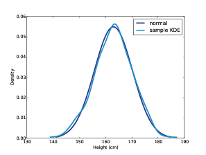
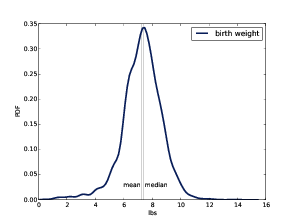
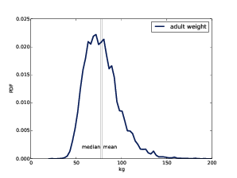

# Probability Density Functions {#probability-density}


The code for this chapter is in `density.py`. For information about
downloading and working with this code, see Section \@ref(using-the-code).

## PDFs

The derivative of a CDF is called a **probability density function**, or PDF.
For example, the PDF of an exponential distribution is 

$$
PDF_{expo}(x) = \lambda e^{-\lambda x}
$$

The PDF of a normal distribution is

$$
PDF_{normal}(x) = {1 \over \sigma \sqrt {2 \pi}} \Bigg[-{1 \over 2} \Big({x - \mu \over \sigma} \Big)^2 \Bigg]
$$

Evaluating a PDF for a particular value
of $x$ is usually not useful. The
result is not a probability; it is a probability *density*. 

In physics, density is mass per unit of
volume; in order to get a mass, you have to multiply by volume or, if
the density is not constant, you have to integrate over volume.

Similarly, **probability density** measures probability
per unit of $x$. In order to get a
probability mass, you have to integrate over $x$.

`thinkstats2` provides a class called
Pdf that represents a probability density function. Every Pdf object
provides the following methods:

-   `Density`, which takes a value,
    `x`, and returns the
    density of the distribution at `x`.
-   `Render`, which evaluates the
    density at a discrete set of values and returns a pair of sequences:
    the sorted values, `xs`,
    and their probability densities, `ds`.
-   `MakePmf`, which evaluates `Density` at a discrete set of
    values and returns a normalized Pmf that approximates the Pdf.
-   `GetLinspace`, which returns the
    default set of points used by `Render` and `MakePmf`.

Pdf is an abstract parent class, which
means you should not instantiate it; that is, you cannot create a Pdf
object. Instead, you should define a child class that inherits from Pdf
and provides definitions of `Density` and `GetLinspace`. Pdf provides `Render` and `MakePmf`.

For example, `thinkstats2` provides a class named
`NormalPdf` that evaluates the
normal density function.

    class NormalPdf(Pdf):

        def __init__(self, mu=0, sigma=1, label=''):
            self.mu = mu
            self.sigma = sigma
            self.label = label

        def Density(self, xs):
            return scipy.stats.norm.pdf(xs, self.mu, self.sigma)

        def GetLinspace(self):
            low, high = self.mu-3*self.sigma, self.mu+3*self.sigma
            return np.linspace(low, high, 101)

The NormalPdf object contains the
parameters `mu` and `sigma`. `Density` uses `scipy.stats.norm`, which is an
object that represents a normal distribution and provides `cdf` and `pdf`, among other methods (see
Section \@ref(the-normal-distribution)). 

The following example creates a NormalPdf
with the mean and variance of adult female heights, in cm, from the
BRFSS (see Section \@ref(the-lognormal-distribution)). Then it computes the density of the
distribution at a location one standard deviation from the mean.

    >>> mean, var = 163, 52.8
    >>> std = math.sqrt(var)
    >>> pdf = thinkstats2.NormalPdf(mean, std)
    >>> pdf.Density(mean + std)
    0.0333001

The result is about 0.03, in units of
probability mass per cm. Again, a probability density doesn’t mean much
by itself. But if we plot the Pdf, we can see the shape of the
distribution:

    >>> thinkplot.Pdf(pdf, label='normal')
    >>> thinkplot.Show()

`thinkplot`.Pdf plots the Pdf as a
smooth function, as contrasted with `thinkplot.Pmf`, which renders a Pmf
as a step function. Figure [6.1](#pdf-example) shows the result, as well as a PDF estimated
from a sample, which we’ll compute in the next section. 

You can use `MakePmf`</span> to approximate the
Pdf:

    >>> pmf = pdf.MakePmf()

By default, the resulting Pmf contains
101 points equally spaced from $\mu - 3 * \sigma$ to $\mu + 3 * \sigma$. Optionally, `MakePmf` and `Render` can take keyword arguments
`low`, `high`, and `n`.

```{r pdf-example, echo=F, out.width='90%', fig.align='center', fig.show='hold', fig.cap='A normal PDF that models adult female height in the U.S., and the kernel density estimate of a sample with $n'}

```


## Kernel Density Estimation

**Kernel
density estimation** (KDE) is an algorithm that takes a sample and
finds an appropriately smooth PDF that fits the data. You can read
details at [http://en.wikipedia.org/wiki/Kernel\_density\_estimation](http://en.wikipedia.org/wiki/Kernel_density_estimation)

`scipy` provides an implementation of
KDE and `thinkstats2` provides
a class called `EstimatedPdf`
that uses it: 

    class EstimatedPdf(Pdf):

        def __init__(self, sample):
            self.kde = scipy.stats.gaussian_kde(sample)

        def Density(self, xs):
            return self.kde.evaluate(xs)

`__init__` takes a sample and computes a
kernel density estimate. The result is a `gaussian_kde` object that
provides an `evaluate`
method.

`Density` takes a value or sequence,
calls `gaussian_kde.evaluate`, and returns the resulting density. The
word “Gaussian” appears in the name because it uses a filter based on a
Gaussian distribution to smooth the KDE. 

Here’s an example that generates a sample
from a normal distribution and then makes an EstimatedPdf to fit it:

    >>> sample = [random.gauss(mean, std) for i in range(500)]
    >>> sample_pdf = thinkstats2.EstimatedPdf(sample)
    >>> thinkplot.Pdf(sample_pdf, label='sample KDE')

`sample` is a list of 500 random heights.
`sample_pdf` is a Pdf object that contains the estimated KDE of the
sample. 

Figure [6.1](#pdf-example) shows the normal density function and a KDE
based on a sample of 500 random heights. The estimate is a good match
for the original distribution.

Estimating a density function with KDE is
useful for several purposes:

-   *Visualization:* During the
    exploration phase of a project, CDFs are usually the best
    visualization of a distribution. After you look at a CDF, you can
    decide whether an estimated PDF is an appropriate model of the
    distribution. If so, it can be a better choice for presenting the
    distribution to an audience that is unfamiliar with CDFs.
-   *Interpolation:* An estimated PDF is
    a way to get from a sample to a model of the population. If you have
    reason to believe that the population distribution is smooth, you
    can use KDE to interpolate the density for values that don’t appear
    in the sample. 
-   *Simulation:* Simulations are often
    based on the distribution of a sample. If the sample size is small,
    it might be appropriate to smooth the sample distribution using KDE,
    which allows the simulation to explore more possible outcomes,
    rather than replicating the observed data. 


## The Distribution Framework

```{r dist-framework, echo=F, out.width='90%', fig.align='center', fig.show='hold', fig.cap='A framework that relates representations of distribution functions.'}
knitr::include_graphics("images/26.png")
```


At this point we have seen PMFs, CDFs and
PDFs; let’s take a minute to review. Figure [6.2](#dist-framework) shows how these functions relate to each
other. 

We started with PMFs, which represent the
probabilities for a discrete set of values. To get from a PMF to a CDF,
you add up the probability masses to get cumulative probabilities. To
get from a CDF back to a PMF, you compute differences in cumulative
probabilities. We’ll see the implementation of these operations in the
next few sections. 

A PDF is the derivative of a continuous
CDF; or, equivalently, a CDF is the integral of a PDF. Remember that a
PDF maps from values to probability densities; to get a probability, you
have to integrate. 

To get from a discrete to a continuous
distribution, you can perform various kinds of smoothing. One form of
smoothing is to assume that the data come from an analytic continuous
distribution (like exponential or normal) and to estimate the parameters
of that distribution. Another option is kernel density estimation.


The opposite of smoothing is **discretizing**, or quantizing. If you
evaluate a PDF at discrete points, you can generate a PMF that is an
approximation of the PDF. You can get a better approximation using
numerical integration. 

To distinguish between continuous and
discrete CDFs, it might be better for a discrete CDF to be a “cumulative
mass function,” but as far as I can tell no one uses that term.


## Hist Implementation


At this point you should know how to use
the basic types provided by `thinkstats2`: Hist, Pmf, Cdf, and
Pdf. The next few sections provide details about how they are
implemented. This material might help you use these classes more
effectively, but it is not strictly necessary. 

Hist and Pmf inherit from a parent class
called `_DictWrapper`. The leading underscore indicates that this class
is “internal;” that is, it should not be used by code in other modules.
The name indicates what it is: a dictionary wrapper. Its primary
attribute is `d`, the
dictionary that maps from values to their frequencies. 

The values can be any hashable type. The
frequencies should be integers, but can be any numeric type.

`_DictWrapper` contains methods
appropriate for both Hist and Pmf, including `__init__`, `Values`, `Items` and `Render`. It also provides modifier
methods `Set`, `Incr`, `Mult`, and `Remove`. These methods are all
implemented with dictionary operations. For example: 

    # class _DictWrapper

        def Incr(self, x, term=1):
            self.d[x] = self.d.get(x, 0) + term

        def Mult(self, x, factor):
            self.d[x] = self.d.get(x, 0) * factor

        def Remove(self, x):
            del self.d[x]

Hist also provides `Freq`, which looks up the frequency
of a given value. 

Because Hist operators and methods are
based on dictionaries, these methods are constant time operations; that
is, their run time does not increase as the Hist gets bigger.


## Pmf Implementation


Pmf and Hist are almost the same thing,
except that a Pmf maps values to floating-point probabilities, rather
than integer frequencies. If the sum of the probabilities is 1, the Pmf
is normalized. 

Pmf provides `Normalize`, which computes the sum
of the probabilities and divides through by a factor:

    # class Pmf

        def Normalize(self, fraction=1.0):
            total = self.Total()
            if total == 0.0:
                raise ValueError('Total probability is zero.')

            factor = float(fraction) / total
            for x in self.d:
                self.d[x] *= factor

            return total

`fraction` determines the sum of the
probabilities after normalizing; the default value is 1. If the total
probability is 0, the Pmf cannot be normalized, so `Normalize` raises `ValueError`.

Hist and Pmf have the same constructor.
It can take as an argument a `dict`, Hist, Pmf or Cdf, a pandas
Series, a list of (value, frequency) pairs, or a sequence of values.

If you instantiate a Pmf, the result is
normalized. If you instantiate a Hist, it is not. To construct an
unnormalized Pmf, you can create an empty Pmf and modify it. The Pmf
modifiers do not renormalize the Pmf.

## Cdf Implementation


A CDF maps from values to cumulative
probabilities, so I could have implemented Cdf as a `_DictWrapper`. But
the values in a CDF are ordered and the values in a `_DictWrapper` are
not. Also, it is often useful to compute the inverse CDF; that is, the
map from cumulative probability to value. So the implementaion I chose
is two sorted lists. That way I can use binary search to do a forward or
inverse lookup in logarithmic time. 

The Cdf constructor can take as a
parameter a sequence of values or a pandas Series, a dictionary that
maps from values to probabilities, a sequence of (value, probability)
pairs, a Hist, Pmf, or Cdf. Or if it is given two parameters, it treats
them as a sorted sequence of values and the sequence of corresponding
cumulative probabilities.

Given a sequence, pandas Series, or
dictionary, the constructor makes a Hist. Then it uses the Hist to
initialize the attributes:

    self.xs, freqs = zip(*sorted(dw.Items()))
    self.ps = np.cumsum(freqs, dtype=np.float)
    self.ps /= self.ps[-1]

`xs` is the sorted list of values;
`freqs` is the list of
corresponding frequencies. `np.cumsum` computes the cumulative
sum of the frequencies. Dividing through by the total frequency yields
cumulative probabilities. For `n` values, the time to construct the
Cdf is proportional to $n log$n$. 

Here is the implementation of `Prob`, which takes a value and
returns its cumulative probability: 

    # class Cdf
        def Prob(self, x):
            if x < self.xs[0]:
                return 0.0
            index = bisect.bisect(self.xs, x)
            p = self.ps[index - 1]
            return p

The `bisect` module provides an
implementation of binary search. And here is the implementation of `Value`, which takes a cumulative
probability and returns the corresponding value:

    # class Cdf
        def Value(self, p):
            if p < 0 or p > 1:
                raise ValueError('p must be in range [0, 1]')

            index = bisect.bisect_left(self.ps, p)
            return self.xs[index]

Given a Cdf, we can compute the Pmf by
computing differences between consecutive cumulative probabilities. If
you call the Cdf constructor and pass a Pmf, it computes differences by
calling `Cdf.Items`:

    # class Cdf
        def Items(self):
            a = self.ps
            b = np.roll(a, 1)
            b[0] = 0
            return zip(self.xs, a-b)

`np.roll` shifts the elements of
`a` to the right, and “rolls”
the last one back to the beginning. We replace the first element of
`b` with 0 and then compute the
difference `a-b`. The result is
a NumPy array of probabilities. 

Cdf provides `Shift` and `Scale`, which modify the values in
the Cdf, but the probabilities should be treated as immutable.


## Moments


Any time you take a sample and reduce it
to a single number, that number is a statistic. The statistics we have
seen so far include mean, variance, median, and interquartile
range.

A **raw
moment** is a kind of statistic. If you have a sample of values,
$x_i$, the $k$th raw moment is: 

$$
m_k^{'} = {1 \over n} \sum_i x_i^k
$$

Or if you prefer Python notation:</span>

    def RawMoment(xs, k):
        return sum(x**k for x in xs) / len(xs)

When $k$=1 the result is the sample mean,
$\bar x$. The other raw moments
don’t mean much by themselves, but they are used in some
computations.

The **central moments** are more useful. The
$k$th central moment is: 

$$
m_k = {1 \over n} \sum_i (x_i - \bar x)^k 
$$


Or in Python:</span>

    def CentralMoment(xs, k):
        mean = RawMoment(xs, 1)
        return sum((x - mean)**k for x in xs) / len(xs)

When $k$=2 the result is the second central
moment, which you might recognize as variance. The definition of
variance gives a hint about why these statistics are called moments. If
we attach a weight along a ruler at each location, $x_i$, and then spin the ruler around the mean, the
moment of inertia of the spinning weights is the variance of the values.
If you are not familiar with moment of inertia, see [http://en.wikipedia.org/wiki/Moment\_of\_inertia](http://en.wikipedia.org/wiki/Moment_of_inertia).

When you report moment-based statistics,
it is important to think about the units. For example, if the values
$x_i$ are in cm, the first raw moment is also in cm.
But the second moment is in cm<sup>2</sup>,
the third moment is in cm<sup>3</sup>,
and so on.

Because of these units, moments are hard
to interpret by themselves. That’s why, for the second moment, it is
common to report standard deviation, which is the square root of
variance, so it is in the same units as $x_i$.


## Skewness


**Skewness** is a property that describes
the shape of a distribution. If the distribution is symmetric around its
central tendency, it is unskewed. If the values extend farther to the
right, it is “right skewed” and if the values extend left, it is “left
skewed.” 

This use of “skewed” does not have the
usual connotation of “biased.” Skewness only describes the shape of the
distribution; it says nothing about whether the sampling process might
have been biased. 

Several statistics are commonly used to
quantify the skewness of a distribution. Given a sequence of values,
$x_i$, the **sample
skewness**, $g_1$,
can be computed like this:

    def StandardizedMoment(xs, k):
        var = CentralMoment(xs, 2)
        std = math.sqrt(var)
        return CentralMoment(xs, k) / std**k

    def Skewness(xs):
        return StandardizedMoment(xs, 3)

$g_1$
is the third **standardized moment**,
which means that it has been normalized so it has no units. 

Negative skewness indicates that a
distribution skews left; positive skewness indicates that a distribution
skews right. The magnitude of $g_1$
indicates the strength of the skewness, but by itself it is not easy to
interpret.

In practice, computing sample skewness is
usually not a good idea. If there are any outliers, they have a
disproportionate effect on $g_1$

Another way to evaluate the asymmetry of
a distribution is to look at the relationship between the mean and
median. Extreme values have more effect on the mean than the median, so
in a distribution that skews left, the mean is less than the median. In
a distribution that skews right, the mean is greater. 

**Pearson’s
median skewness coefficient** is a measure of skewness based on the
difference between the sample mean and median:

$$
g_p = {3 {(\bar x - m)} \over S}
$$


Where $\bar x$ is the sample mean, $m$ is the median, and $S$ is the standard deviation. Or in
Python: 

    def Median(xs):
        cdf = thinkstats2.Cdf(xs)
        return cdf.Value(0.5)

    def PearsonMedianSkewness(xs):
        median = Median(xs)
        mean = RawMoment(xs, 1)
        var = CentralMoment(xs, 2)
        std = math.sqrt(var)
        gp = 3 * (mean - median) / std
        return gp

This statistic is **robust**, which means that it is less
vulnerable to the effect of outliers. 

```{r density-totalwgt-kde, echo=F, out.width='90%', fig.align='center', fig.show='hold', fig.cap='Estimated PDF of birthweight data from the NSFG.'}

```

As an example, let’s look at the skewness
of birth weights in the NSFG pregnancy data. Here’s the code to estimate
and plot the PDF: </span><span id="hevea_default554"></span>

        live, firsts, others = first.MakeFrames()
        data = live.totalwgt_lb.dropna()
        pdf = thinkstats2.EstimatedPdf(data)
        thinkplot.Pdf(pdf, label='birth weight')

Figure [6.3](#density-totalwgt-kde) shows the result. The left tail appears longer
than the right, so we suspect the distribution is skewed left. The mean,
7.27 lbs, is a bit less than the median, 7.38 lbs, so that is consistent
with left skew. And both skewness coefficients are negative: sample
skewness is -0.59; Pearson’s median skewness is -0.23. 

```{r density-wtkg2-kde, echo=F, out.width='90%', fig.align='center', fig.show='hold', fig.cap='Estimated PDF of adult weight data from the BRFSS.'}

```

Now let’s compare this distribution to
the distribution of adult weight in the BRFSS. Again, here’s the code:

        df = brfss.ReadBrfss(nrows=None)
        data = df.wtkg2.dropna()
        pdf = thinkstats2.EstimatedPdf(data)
        thinkplot.Pdf(pdf, label='adult weight')

Figure [6.4](#density-wtkg2-kde) shows the result. The distribution appears
skewed to the right. Sure enough, the mean, 79.0, is bigger than the
median, 77.3. The sample skewness is 1.1 and Pearson’s median skewness
is 0.26. 

The sign of the skewness coefficient
indicates whether the distribution skews left or right, but other than
that, they are hard to interpret. Sample skewness is less robust; that
is, it is more susceptible to outliers. As a result it is less reliable
when applied to skewed distributions, exactly when it would be most
relevant. 

Pearson’s median skewness is based on a
computed mean and variance, so it is also susceptible to outliers, but
since it does not depend on a third moment, it is somewhat more robust.


## Exercises

A solution to this exercise is in `chap06soln.py`.

**Exercise 1**

The distribution of income is famously
skewed to the right. In this exercise, we’ll measure how strong that
skew is.

The Current Population Survey (CPS) is a
joint effort of the Bureau of Labor Statistics and the Census Bureau to
study income and related variables. Data collected in 2013 is available
from [http://www.census.gov/hhes/www/cpstables/032013/hhinc/toc.htm](http://www.census.gov/hhes/www/cpstables/032013/hhinc/toc.htm). I downloaded `hinc06.xls`, which is an Excel
spreadsheet with information about household income, and converted it to
`hinc06.csv`, a CSV file you
will find in the repository for this book. You will also find `hinc2.py`, which reads this file and
transforms the data.

The dataset is in the form of a series
of income ranges and the number of respondents who fell in each range.
The lowest range includes respondents who reported annual household
income “Under $5000.” The highest range includes respondents who made
“$250,000 or more.”

To estimate mean and other statistics
from these data, we have to make some assumptions about the lower and
upper bounds, and how the values are distributed in each range. `hinc2.py` provides `InterpolateSample`, which shows one
way to model this data. It takes a DataFrame with a column, `income`, that contains the upper
bound of each range, and `freq`, which contains the number of
respondents in each frame.

It also takes `log_upper`, which is an
assumed upper bound on the highest range, expressed in `log10` dollars. The default value,
`log_upper=6.0` represents the assumption that the largest income among
the respondents is 10<sup>6</sup>, or one million dollars.

`InterpolateSample` generates a
pseudo-sample; that is, a sample of household incomes that yields the
same number of respondents in each range as the actual data. It assumes
that incomes in each range are equally spaced on a log10 scale.

Compute the median, mean, skewness and
Pearson’s skewness of the resulting sample. What fraction of households
reports a taxable income below the mean? How do the results depend on
the assumed upper bound?


## Glossary


-   **Probability density function (PDF)**:
    The derivative of a continuous CDF, a function that maps a value to
    its probability density. 
-   **Probability density**: A quantity that
    can be integrated over a range of values to yield a probability. If
    the values are in units of cm, for example, probability density is
    in units of probability per cm. 
-   **Kernel density estimation (KDE)**: An
    algorithm that estimates a PDF based on a sample. 
-   **discretize**: To approximate a
    continuous function or distribution with a discrete function. The
    opposite of smoothing. 
-   **raw moment**: A statistic based on the
    sum of data raised to a power. 
-   **central moment**: A statistic based on
    deviation from the mean, raised to a power. 
-   **standardized moment**: A ratio of
    moments that has no units. 
-   **skewness**: A measure of how asymmetric
    a distribution is. 
-   **sample skewness**: A moment-based
    statistic intended to quantify the skewness of a distribution.
-   **Pearson’s median skewness
    coefficient**: A statistic intended to quantify the skewness of a
    distribution based on the median, mean, and standard deviation.
-   **robust**: A statistic is robust if it
    is relatively immune to the effect of outliers. 
