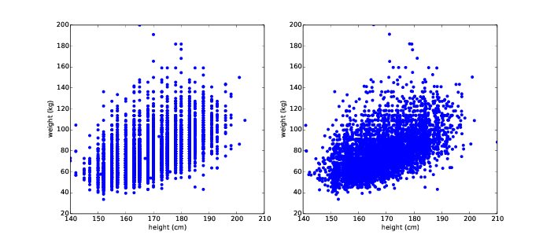
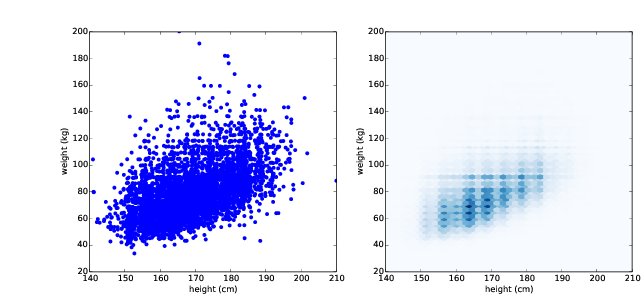

# Relationships between variables {#variable-relationships}


So far we have only looked at one
variable at a time. In this chapter we look at relationships between
variables. Two variables are related if knowing one gives you
information about the other. For example, height and weight are related;
people who are taller tend to be heavier. Of course, it is not a perfect
relationship: there are short heavy people and tall light ones. But if
you are trying to guess someone’s weight, you will be more accurate if
you know their height than if you don’t. 

The code for this chapter is in `scatter.py`. For information about
downloading and working with this code, see Section \@ref(using-the-code).


## Scatter plots


The simplest way to check for a
relationship between two variables is a **scatter plot**, but making a good scatter
plot is not always easy. As an example, I’ll plot weight versus height
for the respondents in the BRFSS (see Section [5.4](thinkstats2006.html#lognormal).

Here’s the code that reads the data file
and extracts height and weight:

        df = brfss.ReadBrfss(nrows=None)
        sample = thinkstats2.SampleRows(df, 5000)
        heights, weights = sample.htm3, sample.wtkg2

`SampleRows` chooses a random subset
of the data: 

    def SampleRows(df, nrows, replace=False):
        indices = np.random.choice(df.index, nrows, replace=replace)
        sample = df.loc[indices]
        return sample

`df` is the DataFrame, `nrows` is the number of rows to
choose, and `replace` is a
boolean indicating whether sampling should be done with replacement; in
other words, whether the same row could be chosen more than once.

`thinkplot` provides `Scatter`, which makes scatter plots:

        thinkplot.Scatter(heights, weights)
        thinkplot.Show(xlabel='Height (cm)',
                       ylabel='Weight (kg)',
                       axis=[140, 210, 20, 200])

The result, in Figure [7.1](#scatter1) (left), shows the shape of the relationship.
As we expected, taller people tend to be heavier.

```{r scatter1, echo=F, out.width='90%', fig.align='center', fig.show='hold', fig.cap='Scatter plots of weight versus height for the respondents in the BRFSS, unjittered (left), jittered (right).'}

```

But this is not the best representation
of the data, because the data are packed into columns. The problem is
that the heights are rounded to the nearest inch, converted to
centimeters, and then rounded again. Some information is lost in
translation. 

We can’t get that information back, but
we can minimize the effect on the scatter plot by **jittering** the data, which means adding
random noise to reverse the effect of rounding off. Since these
measurements were rounded to the nearest inch, they might be off by up
to 0.5 inches or 1.3 cm. Similarly, the weights might be off by 0.5 kg.

        heights = thinkstats2.Jitter(heights, 1.3)
        weights = thinkstats2.Jitter(weights, 0.5)

Here’s the implementation of `Jitter`:

    def Jitter(values, jitter=0.5):
        n = len(values)
        return np.random.uniform(-jitter, +jitter, n) + values

The values can be any sequence; the
result is a NumPy array. 

Figure [7.1](#scatter1) (right) shows the result. Jittering reduces
the visual effect of rounding and makes the shape of the relationship
clearer. But in general you should only jitter data for purposes of
visualization and avoid using jittered data for analysis.

Even with jittering, this is not the best
way to represent the data. There are many overlapping points, which
hides data in the dense parts of the figure and gives disproportionate
emphasis to outliers. This effect is called **saturation**. 

```{r scatter2, echo=F, out.width='90%', fig.align='center', fig.show='hold', fig.cap='Scatter plot with jittering and transparency (left), hexbin plot (right).'}

```


We can solve this problem with the `alpha` parameter, which makes the
points partly transparent:

        thinkplot.Scatter(heights, weights, alpha=0.2)

Figure [7.2](#scatter2) (left) shows the result. Overlapping data
points look darker, so darkness is proportional to density. In this
version of the plot we can see two details that were not apparent
before: vertical clusters at several heights and a horizontal line near
90 kg or 200 pounds. Since this data is based on self-reports in pounds,
the most likely explanation is that some respondents reported rounded
values. 

Using transparency works well for
moderate-sized datasets, but this figure only shows the first 5000
records in the BRFSS, out of a total of 414,509. 

To handle larger datasets, another option
is a hexbin plot, which divides the graph into hexagonal bins and colors
each bin according to how many data points fall in it. `thinkplot` provides `HexBin`: 

        thinkplot.HexBin(heights, weights)

Figure [7.2](#scatter2) (right) shows the result. An advantage of a
hexbin is that it shows the shape of the relationship well, and it is
efficient for large datasets, both in time and in the size of the file
it generates. A drawback is that it makes the outliers invisible.

The point of this example is that it is
not easy to make a scatter plot that shows relationships clearly without
introducing misleading artifacts. 

## Characterizing relationships

Scatter plots provide a general
impression of the relationship between variables, but there are other
visualizations that provide more insight into the nature of the
relationship. One option is to bin one variable and plot percentiles of
the other.

NumPy and pandas provide functions for
binning data: 

        df = df.dropna(subset=['htm3', 'wtkg2'])
        bins = np.arange(135, 210, 5)
        indices = np.digitize(df.htm3, bins)
        groups = df.groupby(indices)

`dropna` drops rows with `nan` in any of the listed columns.
`arange` makes a NumPy array of
bins from 135 to, but not including, 210, in increments of 5.

`digitize` computes the index of the
bin that contains each value in `df.htm3`. The result is a NumPy
array of integer indices. Values that fall below the lowest bin are
mapped to index 0. Values above the highest bin are mapped to `len(bins)`.

```{r scatter3, echo=F, out.width='90%', fig.align='center', fig.show='hold', fig.cap='Percentiles of weight for a range of height bins.'}
knitr::include_graphics("images/31.png")
```

`groupby` is a DataFrame method that
returns a GroupBy object; used in a `for` loop, `groups` iterates the names of the
groups and the DataFrames that represent them. So, for example, we can
print the number of rows in each group like this: 

    for i, group in groups:
        print(i, len(group))

Now for each group we can compute the
mean height and the CDF of weight: 

        heights = [group.htm3.mean() for i, group in groups]
        cdfs = [thinkstats2.Cdf(group.wtkg2) for i, group in groups]

Finally, we can plot percentiles of
weight versus height: 

        for percent in [75, 50, 25]:
            weights = [cdf.Percentile(percent) for cdf in cdfs]
            label = '%dth' % percent
            thinkplot.Plot(heights, weights, label=label)

Figure [7.3](#scatter3) shows the result. Between 140 and 200 cm the
relationship between these variables is roughly linear. This range
includes more than 99% of the data, so we don’t have to worry too much
about the extremes. 


## Correlation

A **correlation** is a statistic intended to
quantify the strength of the relationship between two variables.

A challenge in measuring correlation is
that the variables we want to compare are often not expressed in the
same units. And even if they are in the same units, they come from
different distributions.

There are two common solutions to these
problems:

1.  Transform each value to a **standard scores**, which is the number
    of standard deviations from the mean. This transform leads to the
    “Pearson product-moment correlation coefficient.” 
2.  Transform each value to its **rank**, which is its index in the
    sorted list of values. This transform leads to the “Spearman rank
    correlation coefficient.” 

If $X$ is a series of $n$ values, $x_i, we can convert to standard scores by
subtracting the mean and dividing by the standard deviation: $z_i = (x_i − \mu) / \sigma$. 

The numerator is a deviation: the
distance from the mean. Dividing by $\sigma$ **standardizes** the deviation, so the
values of $Z$ are dimensionless (no
units) and their distribution has mean 0 and variance 1. 

If $X$ is normally distributed, so is $Z$. But if $X$ is skewed or has outliers, so does
$Z$; in those cases, it is more
robust to use percentile ranks. If we compute a new variable, $R$, so that $r_i is the rank of $x_i, 
the distribution of $R$ is uniform from 1 to $n$, regardless of the distribution of
$X$. 

## Covariance


**Covariance** is a measure of the tendency
of two variables to vary together. If we have two series, $X$ and $Y$, their deviations from the mean are

$$
dx_i = x_i - \bar x
$$

$$
dy_i = y_i - \bar y
$$

where $\bar x$ is the sample mean of $X$ and $\bar y$ is the sample mean of $Y$. If $X$ and $Y$ vary together, their deviations tend to have the same sign.

If we multiply them together, the product
is positive when the deviations have the same sign and negative when
they have the opposite sign. So adding up the products gives a measure
of the tendency to vary together.

Covariance is the mean of these products:

$$
Cov(X,Y) = {1 \over n} \sum dx_i dy_i
$$

where $n$ is the length of the two series (they have to be the same length).

If you have studied linear algebra, you
might recognize that `Cov` is
the dot product of the deviations, divided by their length. So the
covariance is maximized if the two vectors are identical, 0 if they are
orthogonal, and negative if they point in opposite directions. `thinkstats2` uses `np.dot` to implement `Cov` efficiently: 

    def Cov(xs, ys, meanx=None, meany=None):
        xs = np.asarray(xs)
        ys = np.asarray(ys)

        if meanx is None:
            meanx = np.mean(xs)
        if meany is None:
            meany = np.mean(ys)

        cov = np.dot(xs-meanx, ys-meany) / len(xs)
        return cov

By default `Cov` computes deviations from the
sample means, or you can provide known means. If `xs` and `ys` are Python sequences, `np.asarray` converts them to NumPy
arrays. If they are already NumPy arrays, `np.asarray` does nothing.

This implementation of covariance is
meant to be simple for purposes of explanation. NumPy and pandas also
provide implementations of covariance, but both of them apply a
correction for small sample sizes that we have not covered yet, and
`np.cov` returns a covariance
matrix, which is more than we need for now. 


## Pearson’s correlation


Covariance is useful in some
computations, but it is seldom reported as a summary statistic because
it is hard to interpret. Among other problems, its units are the product
of the units of $X$ and $Y$. For example, the covariance of
weight and height in the BRFSS dataset is 113 kilogram-centimeters,
whatever that means. 

One solution to this problem is to divide
the deviations by the standard deviation, which yields standard scores,
and compute the product of standard scores:

$$
p_i = {(x_i - \bar x) \over S_X}{(y_i - \bar y) \over S_Y}
$$

Where $S_X$ and $S_Y$ are the standard deviations of $X$ and $Y$. The mean of these products is

$$
\varrho = {1 \over n} \sum p_i
$$


Or we can rewrite ρ by factoring out
$S_X$ and $S_Y$:

$$
\varrho = {Cov(X,Y) \over S_X S_Y}
$$


This value is called **Pearson’s correlation** after Karl
Pearson, an influential early statistician. It is easy to compute and
easy to interpret. Because standard scores are dimensionless, so is $\varrho$.

Here is the implementation in `thinkstats2`:

    def Corr(xs, ys):
        xs = np.asarray(xs)
        ys = np.asarray(ys)

        meanx, varx = MeanVar(xs)
        meany, vary = MeanVar(ys)

        corr = Cov(xs, ys, meanx, meany) / math.sqrt(varx * vary)
        return corr

`MeanVar` computes mean and variance
slightly more efficiently than separate calls to `np.mean` and `np.var`. 

Pearson’s correlation is always between
-1 and +1 (including both). If $\varrho$ is positive, we say that the
correlation is positive, which means that when one variable is high, the
other tends to be high. If $\varrho$ is negative, the correlation is negative,
so when one variable is high, the other is low.</span>

The magnitude of $\varrho$ indicates the strength
of the correlation. If $\varrho$ is 1 or -1, the variables are perfectly
correlated, which means that if you know one, you can make a perfect
prediction about the other. 

Most correlation in the real world is not
perfect, but it is still useful. The correlation of height and weight is
0.51, which is a strong correlation compared to similar human-related
variables.


## Nonlinear relationships

If Pearson’s correlation is near 0, it is
tempting to conclude that there is no relationship between the
variables, but that conclusion is not valid. Pearson’s correlation only
measures *linear* relationships. If there’s a nonlinear relationship, $\varrho$
understates its strength. 

```{r corr-examples, echo=F, out.width='90%', fig.align='center', fig.show='hold', fig.cap='Examples of datasets with a range of correlations.'}
knitr::include_graphics("images/32.png")
```

Figure [7.4](#corr-examples) is from [http://wikipedia.org/wiki/Correlation\_and\_dependence](http://wikipedia.org/wiki/Correlation_and_dependence). It shows scatter plots and correlation
coefficients for several carefully constructed datasets. 

The top row shows linear relationships
with a range of correlations; you can use this row to get a sense of
what different values of ρ look like. The second row shows perfect
correlations with a range of slopes, which demonstrates that correlation
is unrelated to slope (we’ll talk about estimating slope soon). The
third row shows variables that are clearly related, but because the
relationship is nonlinear, the correlation coefficient is 0.

The moral of this story is that you
should always look at a scatter plot of your data before blindly
computing a correlation coefficient. 


## Spearman’s rank correlation

Pearson’s correlation works well if the
relationship between variables is linear and if the variables are
roughly normal. But it is not robust in the presence of outliers.

Spearman’s rank correlation is an alternative
that mitigates the effect of outliers and skewed distributions. To
compute Spearman’s correlation, we have to compute the **rank** of each value, which is its index
in the sorted sample. For example, in the sample `[1, 2, 5, 7]` the rank of the
value 5 is 3, because it appears third in the sorted list. Then we
compute Pearson’s correlation for the ranks. 

`thinkstats2` provides a function
that computes Spearman’s rank correlation:

    def SpearmanCorr(xs, ys):
        xranks = pandas.Series(xs).rank()
        yranks = pandas.Series(ys).rank()
        return Corr(xranks, yranks)

I convert the arguments to pandas Series
objects so I can use `rank`,
which computes the rank for each value and returns a Series. Then I use
`Corr` to compute the
correlation of the ranks. 

I could also use `Series.corr` directly and specify
Spearman’s method:

    def SpearmanCorr(xs, ys):
        xs = pandas.Series(xs)
        ys = pandas.Series(ys)
        return xs.corr(ys, method='spearman')

The Spearman rank correlation for the
BRFSS data is 0.54, a little higher than the Pearson correlation, 0.51.
There are several possible reasons for the difference, including:

-   If the relationship is nonlinear,
    Pearson’s correlation tends to underestimate the strength of the
    relationship, and 
-   Pearson’s correlation can be affected
    (in either direction) if one of the distributions is skewed or
    contains outliers. Spearman’s rank correlation is more robust.

In the BRFSS example, we know that the
distribution of weights is roughly lognormal; under a log transform it
approximates a normal distribution, so it has no skew. So another way to
eliminate the effect of skewness is to compute Pearson’s correlation
with log-weight and height: 

        thinkstats2.Corr(df.htm3, np.log(df.wtkg2)))

The result is 0.53, close to the rank
correlation, 0.54. So that suggests that skewness in the distribution of
weight explains most of the difference between Pearson’s and Spearman’s
correlation. 

## Correlation and causation


If variables A and B are correlated,
there are three possible explanations: A causes B, or B causes A, or
some other set of factors causes both A and B. These explanations are
called “causal relationships”.

Correlation alone does not distinguish
between these explanations, so it does not tell you which ones are true.
This rule is often summarized with the phrase “Correlation does not
imply causation,” which is so pithy it has its own Wikipedia page:
[http://wikipedia.org/wiki/Correlation\_does\_not\_imply\_causation](http://wikipedia.org/wiki/Correlation_does_not_imply_causation).

So what can you do to provide evidence of
causation?

1.  Use time. If A comes before B, then A
    can cause B but not the other way around (at least according to our
    common understanding of causation). The order of events can help us
    infer the direction of causation, but it does not preclude the
    possibility that something else causes both A and B.
2.  Use randomness. If you divide a large
    sample into two groups at random and compute the means of almost any
    variable, you expect the difference to be small. If the groups are
    nearly identical in all variables but one, you can eliminate
    spurious relationships.

    This works even if you don’t know
    what the relevant variables are, but it works even better if you do,
    because you can check that the groups are identical.

These ideas are the motivation for the
**randomized controlled trial**, in
which subjects are assigned randomly to two (or more) groups: a **treatment group** that receives some kind
of intervention, like a new medicine, and a **control group** that receives no
intervention, or another treatment whose effects are known. 

A randomized controlled trial is the most
reliable way to demonstrate a causal relationship, and the foundation of
science-based medicine (see [http://wikipedia.org/wiki/Randomized\_controlled\_trial](http://wikipedia.org/wiki/Randomized_controlled_trial).

Unfortunately, controlled trials are only
possible in the laboratory sciences, medicine, and a few other
disciplines. In the social sciences, controlled experiments are rare,
usually because they are impossible or unethical. 

An alternative is to look for a **natural experiment**, where different
“treatments” are applied to groups that are otherwise similar. One
danger of natural experiments is that the groups might differ in ways
that are not apparent. You can read more about this topic at
[http://wikipedia.org/wiki/Natural\_experiment](http://wikipedia.org/wiki/Natural_experiment). 

In some cases it is possible to infer
causal relationships using **regression
analysis**, which is the topic of Chapter 11 \ref().


## Exercises

A solution to this exercise is in
`chap07soln.py`.

**Exercise 1**
Using data from the NSFG,
make a scatter plot of birth weight versus mother’s age. Plot
percentiles of birth weight versus mother’s age. Compute Pearson’s and
Spearman’s correlations. How would you characterize the relationship
between these variables?

## Glossary

-   **scatter plot**: A visualization of the
    relationship between two variables, showing one point for each row
    of data. 
-   **jitter**: Random noise added to data
    for purposes of visualization. 
-   **saturation**: Loss of information when
    multiple points are plotted on top of each other. 
-   **correlation**: A statistic that
    measures the strength of the relationship between two variables.
-   **standardize**: To transform a set of
    values so that their mean is 0 and their variance is 1. 
-   **standard score**: A value that has been
    standardized so that it is expressed in standard deviations from the
    mean. 
-   **covariance**: A measure of the tendency
    of two variables to vary together.
-   **rank**: The index where an element
    appears in a sorted list.
-   **randomized controlled trial**: An
    experimental design in which subjects are divided into groups at
    random, and different groups are given different treatments.
-   **treatment group**: A group in a
    controlled trial that receives some kind of intervention.
-   **control group**: A group in a
    controlled trial that receives no treatment, or a treatment whose
    effect is known. 
-   **natural experiment**: An experimental
    design that takes advantage of a natural division of subjects into
    groups in ways that are at least approximately random. 

